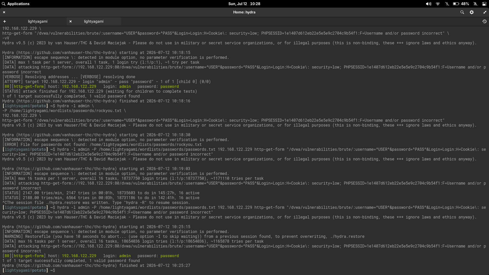
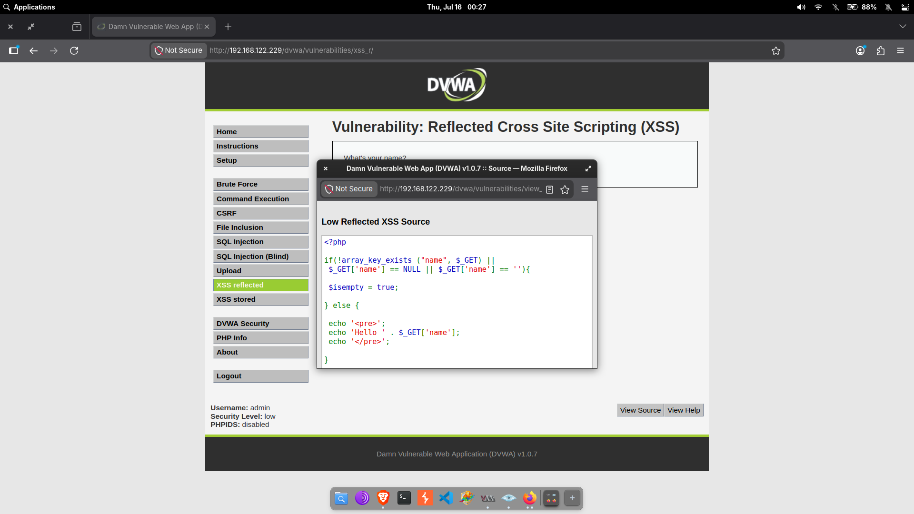
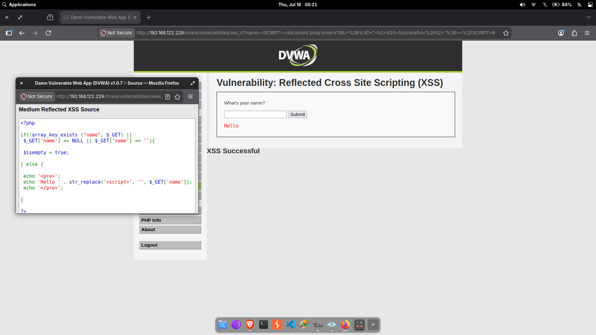
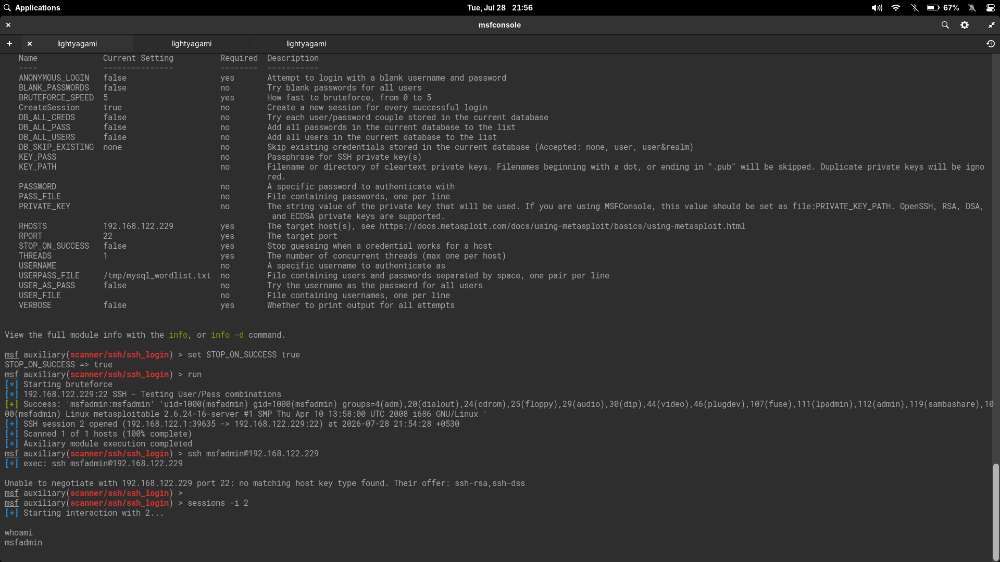
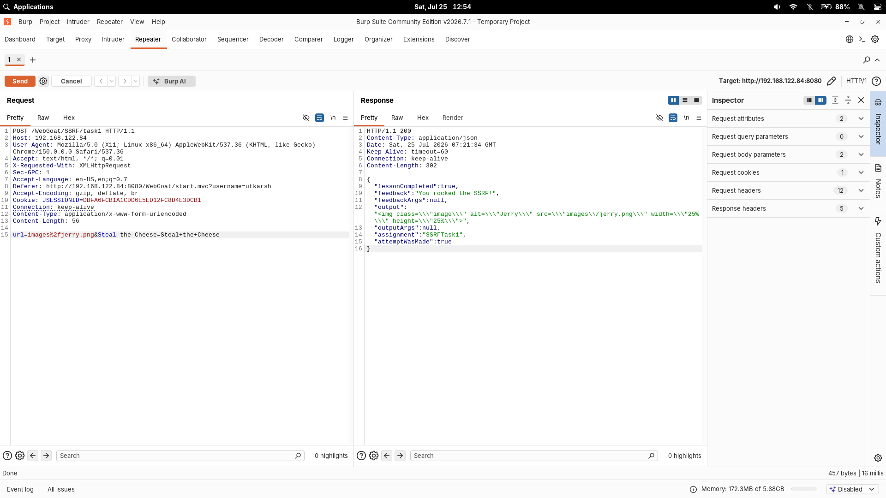
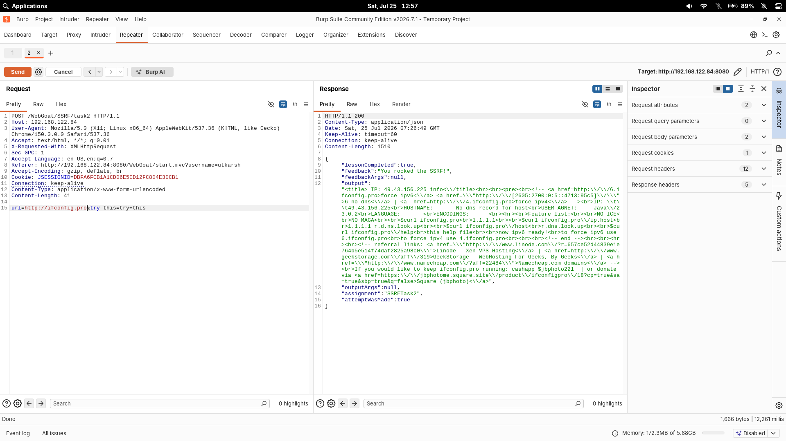

# Security Labs

[](LICENSE)
[](#lab-index)
[](machines/metasploitable2/)

I built this lab environment to practice penetration testing and web application security workflows in a controlled, isolated network. Every lab here documents what I found, what broke, and what I learned across Metasploitable 2, DVWA, and WebGoat.

> All activity was performed in an isolated lab environment for educational purposes.

---

## Lab Index

| Lab | Target | Technique | Status |
| --- | --- | --- | --- |
| [vsFTPd 2.3.4 Backdoor](machines/metasploitable2/vsftpd-2.3.4-backdoor/README.md) | Metasploitable 2 | Metasploit — CVE-2011-2523 | Complete |
| [SSH Login Brute-Force](machines/metasploitable2/ssh-login-bruteforce-msfadmin/README.md) | Metasploitable 2 | Metasploit — ssh_login auxiliary | Complete |
| [Telnet Login Brute-Force](machines/metasploitable2/telnet-login-bruteforce-msfadmin/README.md) | Metasploitable 2 | Metasploit — telnet_login auxiliary | Complete |
| [DVWA Brute Force](web-apps/dvwa/dvwa-brute-force/README.md) | DVWA on Metasploitable 2 | Hydra — HTTP form brute-force | Complete |
| [DVWA Reflected XSS](web-apps/dvwa/dvwa-reflected-xss/README.md) | DVWA on Metasploitable 2 | Reflected XSS — blacklist bypass | Complete |
| [WebGoat SSRF](web-apps/webgoat/webgoat-ssrf/README.md) | WebGoat (Docker) | Burp Suite — SSRF parameter tampering | Complete |

---

## Methodology

Labs follow the same core workflow, adapted to the target and vulnerability:

| Phase | My Approach |
|---|---|
| **Reconnaissance** | Nmap/Zenmap service discovery, port scanning, OS fingerprinting. Identify every open port and banner before choosing a target. |
| **Enumeration** | Version-to-CVE mapping. Research the specific service version, review exploit behavior, and identify prerequisites — LHOST reachability, session cookies, module quirks. |
| **Exploitation** | Configure and run the exploit. When it breaks — and it will — troubleshoot methodically: verify the network path, check module options, read the error output. |
| **Post-Exploitation** | Validate access level (whoami, id, uname -a), navigate the filesystem, capture evidence. A shell is not the end; confirming what you have is. |
| **Remediation** | Map findings to actionable controls: version upgrades, configuration hardening, network segmentation, detection rules. |

---

## Featured Labs

### vsFTPd 2.3.4 Backdoor

Found `vsftpd 2.3.4` on port 21 during an Nmap scan. Mapped it to CVE-2011-2523 and selected the Metasploit module. The first few attempts failed because I set the wrong `LHOST` — the target couldn't route back to my listener. After fixing the address and enabling `ForceExploit` to bypass a stale port-6200 check, I landed a root Meterpreter shell. The troubleshooting (wrong LHOST, ForceExploit flag) taught me more about how reverse payloads actually work than a clean exploit ever would have.

[Full writeup →](machines/metasploitable2/vsftpd-2.3.4-backdoor/README.md)

| Evidence | Description |
| --- | --- |
|  | Nmap scan that first identified vsftpd 2.3.4 on 21/tcp. |
|  | Module options I configured before the exploit. |
|  | Meterpreter session after fixing LHOST and enabling ForceExploit. |
|  | Post-exploit validation — whoami and uname -a confirmed root. |

### DVWA Brute Force

A Hydra brute-force against the DVWA login page. The admin account still used `password` as its credential. The key learning was the session cookie — without injecting the `PHPSESSID` header into Hydra's request, every attempt redirects to the login page regardless of credential correctness. I also ran an 18.6-million-entry wordlist, hit ~2,188 attempts/minute, and calculated it would take 6 days to complete. That taught me to always start with a smaller, targeted list.

[Full writeup →](web-apps/dvwa/dvwa-brute-force/README.md)

| Evidence | Description |
| --- | --- |
|  | Successful admin:password login after Hydra brute-force. |
|  | Full Hydra session — single-password test, wordlist run, and result. |
|  | Nmap recon alongside Hydra output. |

### DVWA Reflected XSS

A source-code-driven review of DVWA's Reflected XSS module across Low, Medium, and High security levels. The Low level reflected raw HTML directly into the page, while the Medium level tried to remove only the exact lowercase `<script>` string with `str_replace()`. The bypass worked because HTML tag names are case-insensitive, so Firefox treated uppercase `<SCRIPT>` as a valid script tag. The High level showed the correct defensive pattern: output encoding with `htmlspecialchars()`.

[Full writeup →](web-apps/dvwa/dvwa-reflected-xss/README.md)

| Evidence | Description |
| --- | --- |
|  | Low security source code directly reflecting the `name` parameter. |
|  | Browser rendering user-controlled `<b>` tags as HTML. |
|  | Medium security source code using a case-sensitive blacklist. |
|  | Uppercase `<SCRIPT>` bypass resulting in JavaScript execution. |

### SSH Login Brute-Force

Used Metasploit's `ssh_login` auxiliary module with a targeted wordlist against Metasploitable 2. The module immediately found `msfadmin:msfadmin` — default credentials that should have been changed. Modern OpenSSH clients failed to connect due to disabled legacy host key algorithms, but Metasploit's built-in SSH client handled compatibility transparently. The session confirmed user-level access as `msfadmin`.

[Full writeup →](machines/metasploitable2/ssh-login-bruteforce-msfadmin/README.md)

| Evidence | Description |
| --- | --- |
|  | Metasploit console showing configured module and successful `msfadmin:msfadmin` discovery. |

### Telnet Login Brute-Force

Used Metasploit's `telnet_login` auxiliary module with separate username and password wordlists. Unlike `ssh_login` which uses paired `USERPASS_FILE`, `telnet_login` brute-forces every combination of `USER_FILE` × `PASS_FILE` — a cartesian product strategy. The same `msfadmin:msfadmin` credential worked here too, demonstrating credential reuse across services.

[Full writeup →](machines/metasploitable2/telnet-login-bruteforce-msfadmin/README.md)

| Evidence | Description |
| --- | --- |
|  | Module search, options, and wordlist configuration. |
|  | Successful login and `whoami` validation. |

### WebGoat SSRF

A Server-Side Request Forgery (SSRF) exercise using WebGoat (Docker) and Burp Suite. Task 1 demonstrated blind path manipulation — changing `tom.png` to `jerry.png` in the `url` parameter made the server fetch a different local resource. Task 2 escalated to full external URL control by pointing the server to `http://ifconfig.pro`, which returned its public IP. The server performed the outbound request with no validation on the target URL.

[Full writeup →](web-apps/webgoat/webgoat-ssrf/README.md)

| Evidence | Description |
| --- | --- |
|  | Burp Suite intercept showing the `url` parameter change from `tom.png` to `jerry.png`. |
|  | External URL fetch to `http://ifconfig.pro` returning the server's public IP. |

---

## What I Learned

- **Wrong `LHOST` is the most common failure.** Reverse payloads fail silently if the target can't reach your listener. Always verify network path before running an exploit.
- **Session cookies are everything in web app testing.** Without injecting the `PHPSESSID`, every brute-force attempt hits a login redirect — valid credentials or not.
- **Blacklist filtering does not solve XSS.** The Medium DVWA filter removed only lowercase `<script>`, but browser parsing still accepted uppercase `<SCRIPT>`.
- **Output encoding changes the browser's interpretation.** `htmlspecialchars()` worked because user input stayed text instead of becoming markup.
- **`ForceExploit` bypasses a safety check, not a technical barrier.** It worked here because I had already confirmed the target was vulnerable. In a real engagement, dig deeper rather than force it.
- **Wordlist size is a time budget.** 18.6 million entries at 2,188 tries/min is ~6 days. Start small, confirm syntax, then scale.
- **Troubleshooting failures teaches more than clean successes.** The wrong-LHOST error, the stale port-6200 check, the redirect without a cookie — each of these forced me to understand what the tools were actually doing.
- **Unvalidated URL parameters enable SSRF.** Changing a filename from `tom.png` to `jerry.png` is harmless, but replacing it with an external URL or internal metadata endpoint gives the attacker control of the server's request direction.
- **Metasploit handles protocol compatibility better than CLI tools.** Modern OpenSSH rejects legacy host key algorithms (`ssh-rsa`, `ssh-dss`), but Metasploit's built-in SSH client connects to old servers without issue.
- **`ssh_login` and `telnet_login` use different brute-force strategies.** The former uses paired `USERPASS_FILE` entries; the latter tries every combination of `USER_FILE` × `PASS_FILE`. Wordlist strategy must match the module.
- **Credential reuse magnifies impact.** The same `msfadmin:msfadmin` works across SSH, Telnet, and system console on Metasploitable 2. One weak password compromises multiple services.

---

## Repository Layout

```text
labs/
├── machines/
│   └── metasploitable2/
│       ├── README.md
│       ├── vsftpd-2.3.4-backdoor/
│       ├── ssh-login-bruteforce-msfadmin/
│       └── telnet-login-bruteforce-msfadmin/
├── web-apps/
│   ├── dvwa/
│   │   ├── dvwa-brute-force/
│   │   └── dvwa-reflected-xss/
│   └── webgoat/
│       └── webgoat-ssrf/
├── .gitignore
├── LICENSE
└── README.md
```

---

## Lab Topology

| Node | Role | Address |
|---|---|---|
| Linux pentest workstation | Attacker | `192.168.122.1` |
| Metasploitable 2 | Target | `192.168.122.229` |
| WebGoat (Docker) | Target | `192.168.122.84:8080` |
| Virtual network | Isolated NAT | `192.168.122.0/24` |

**Tools:** Nmap, Zenmap, Metasploit Framework, Meterpreter, Hydra, Burp Suite, Netcat, Firefox, John the Ripper

---

## Tools

- [Metasploit Framework](https://www.metasploit.com/)
- [Hydra](https://github.com/vanhauser-thc/thc-hydra)
- [Nmap](https://nmap.org/)
- [Netcat](https://nc110.sourceforge.io/)
- [Firefox](https://www.mozilla.org/firefox/)
- [Metasploitable 2](https://docs.rapid7.com/metasploit/metasploitable-2/)
- [DVWA](https://github.com/digininja/DVWA)
- [WebGoat](https://github.com/WebGoat/WebGoat)
- [Burp Suite Community Edition](https://portswigger.net/burp/communitydownload)

---

## Legal Notice

The content in this repository is for authorized lab use only. Do not run these techniques against systems you do not own or do not have explicit permission to test.
