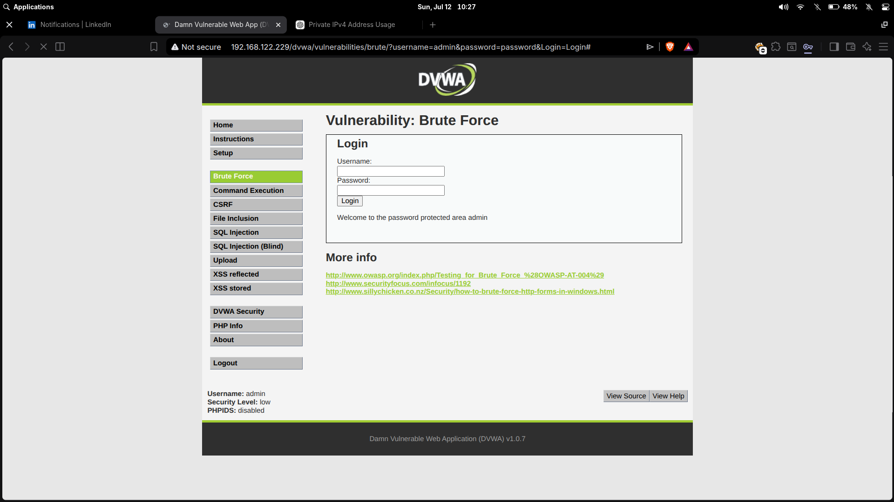

# Security Labs

[](LICENSE)
[](#lab-index)
[](machines/metasploitable2/)

Hands-on penetration testing labs documenting real exploitation workflows against intentionally vulnerable machines.

> All activity was performed in an isolated lab environment for educational purposes.

---

## Lab Index

| Lab | Target | Technique | Status |
| --- | --- | --- | --- |
| [vsFTPd 2.3.4 Backdoor](machines/metasploitable2/vsftpd-2.3.4-backdoor/README.md) | Metasploitable 2 | Metasploit — CVE-2011-2523 | Complete |
| [DVWA Brute Force](machines/metasploitable2/dvwa-brute-force/README.md) | Metasploitable 2 | Hydra — HTTP form brute-force | Complete |

---

## Featured Labs

### vsFTPd 2.3.4 Backdoor

This lab identifies `vsftpd 2.3.4` on Metasploitable 2, maps it to CVE-2011-2523, troubleshoots failed reverse callback behavior, and validates a root shell through Meterpreter.

[Full writeup →](machines/metasploitable2/vsftpd-2.3.4-backdoor/README.md)

| Evidence | Description |
| --- | --- |
|  | Nmap/Zenmap service discovery showing `vsftpd 2.3.4` on `21/tcp`. |
|  | Module search, selection, and required options. |
|  | Successful exploit after ForceExploit troubleshooting. |
|  | `whoami` and `uname -a` from interactive shell. |

### DVWA Brute Force

A brute-force attack against the Damn Vulnerable Web Application (DVWA) login page using Hydra. Demonstrates weak credential discovery, session cookie injection, and the impact of missing rate-limiting controls.

[Full writeup →](machines/metasploitable2/dvwa-brute-force/README.md)

| Evidence | Description |
| --- | --- |
|  | DVWA Brute Force page showing successful `admin:password` login. |
|  | Full hydra sequence: single-password test, wordlist run, and result. |
|  | Nmap service scan of target alongside hydra output. |

---

## Repository Layout

```text
labs/
├── machines/
│   └── metasploitable2/
│       ├── README.md
│       ├── vsftpd-2.3.4-backdoor/
│       └── dvwa-brute-force/
├── .gitignore
├── LICENSE
└── README.md
```

---

## Lab Environment

- **Attacker:** Linux penetration testing workstation
- **Target:** Metasploitable 2
- **Network:** Isolated `192.168.122.0/24` virtual network
- **Tools:** Nmap, Zenmap, Metasploit Framework, Meterpreter, Hydra, Netcat

---

## Skills Demonstrated

- Network and service enumeration with Nmap
- Version-based vulnerability identification
- Metasploit module selection, configuration, and troubleshooting
- Web application brute-forcing with Hydra
- Session cookie injection for authenticated testing
- Post-exploitation validation (filesystem access, privilege verification)
- Professional lab documentation and Git workflow

---

## Tools

- [Metasploit Framework](https://www.metasploit.com/)
- [Hydra](https://github.com/vanhauser-thc/thc-hydra)
- [Nmap](https://nmap.org/)
- [Netcat](https://nc110.sourceforge.io/)
- [Metasploitable 2](https://docs.rapid7.com/metasploit/metasploitable-2/)
- [DVWA](https://github.com/digininja/DVWA)

---

## Legal Notice

The content in this repository is for authorized lab use only. Do not run these techniques against systems you do not own or do not have explicit permission to test.
