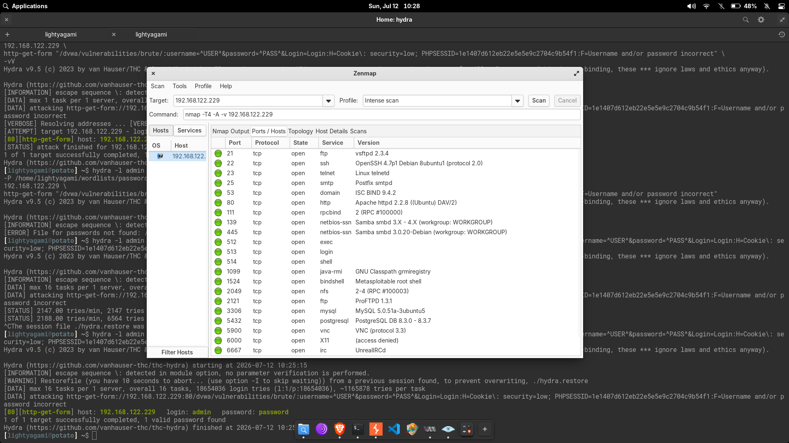

# DVWA Brute Force — Hydra Password Attack

This lab documents a brute-force attack against the Damn Vulnerable Web Application (DVWA) Brute Force module running on Metasploitable 2. The activity was performed in an isolated virtual lab environment for educational purposes.

---

## Objective

Bypass the HTTP Basic-form authentication on the DVWA Brute Force page using Hydra, demonstrate the risk of weak credentials, and validate successful login to the protected area.

---

## Lab Information

| Field | Detail |
|---|---|
| **Target** | Metasploitable 2 — `192.168.122.229` |
| **Attacker** | Linux penetration testing workstation — `192.168.122.1` |
| **Difficulty** | Beginner |
| **Tools Used** | Nmap, Hydra |
| **Vulnerability Type** | Brute Force (weak credentials, no rate-limiting) |
| **Date** | 2026-07-12 |

---

## Lab Setup

> [!NOTE]
> DVWA security level was set to **low** and PHPIDS was **disabled**. At this setting, no brute-force protections (rate-limiting, account lockout, or CAPTCHA) are enforced.

The lab consisted of two virtual machines on an isolated `192.168.122.0/24` network:

1. **Attacker** — A Linux workstation with Hydra and Nmap installed.
2. **Target** — Metasploitable 2 running Apache HTTPD with DVWA.

DVWA was accessed at:

```
http://192.168.122.229/dvwa/
```

Before the brute-force attack began, a valid session cookie was obtained by manually logging into DVWA's main page with the default credentials (`admin:password`) and noting the `PHPSESSID`.

---

## Reconnaissance

### Nmap Service Scan

An aggressive service discovery scan was run against the target to enumerate open ports and services:

```bash
nmap -T4 -A -v 192.168.122.229
```

The scan confirmed that Metasploitable 2 exposes numerous vulnerable services. The relevant finding for this lab was the web server on port `80/tcp`:



| Port | Service | Version |
|---|---|---|
| `21/tcp` | FTP | vsftpd 2.3.4 |
| `22/tcp` | SSH | OpenSSH 4.7p1 Debian 8ubuntu1 |
| `23/tcp` | Telnet | Linux telnetd |
| `25/tcp` | SMTP | Postfix smtpd |
| `53/tcp` | DNS | ISC BIND 9.4.2 |
| `80/tcp` | HTTP | Apache httpd 2.2.8 (Ubuntu) DAV/2 |
| `139/tcp`, `445/tcp` | SMB | Samba smbd |
| `3306/tcp` | MySQL | MySQL 5.0.51a-3ubuntu5 |

> [!IMPORTANT]
> Port `80/tcp` was the entry point for this lab. The DVWA application is served over HTTP with no encryption, meaning all credentials in transit are plaintext.

---

## Enumeration

### DVWA Brute Force Page

Navigating to the DVWA Brute Force vulnerability page revealed a simple login form requiring a username and password:


The form issues an HTTP GET request to:

```
/dvwa/vulnerabilities/brute/
```

with the parameters `username`, `password`, and `Login` sent as query string parameters.

### Failure Fingerprint

An incorrect login attempt returns the message:

```
Username and/or password incorrect
```

This string was used as the failure condition in the Hydra command to distinguish valid credentials from invalid ones.

---

## Attack Method

### Why Hydra?

Hydra is a high-speed network login cracker that supports numerous protocols, including HTTP GET forms. It was chosen because:

- It supports custom HTTP request parameters via `http-get-form`.
- It allows injection of `^USER^` and `^PASS^` placeholders directly into the request string.
- It supports custom HTTP headers (required for the session cookie).
- It can parallelise connection attempts for faster brute-forcing.

### Initial Test — Single Password

Before launching a full wordlist attack, a quick test was performed with the single guess `password` for the `admin` user:

> [!TIP]
> Always start with a small test. This confirms the Hydra syntax is correct before committing to a long-running scan.

```bash
hydra -l admin \
  -p password \
  192.168.122.229 \
  http-get-form \
  "/dvwa/vulnerabilities/brute/:\
username=^USER^&password=^PASS^&Login=Login:\
H=Cookie\: security=low; PHPSESSID=1e1407d612eb22e5e5e9c2704c9b54f1:\
F=Username and/or password incorrect"
```

**Result:** `admin:password` was accepted immediately.

The full attack sequence was captured in the terminal:


### Hydra Command Breakdown

| Component | Value | Purpose |
|---|---|---|
| `-l admin` | `admin` | Single username to test (no username wordlist needed here) |
| `-p password` | `password` | Single password to test |
| `192.168.122.229` | Target IP | The Metasploitable 2 host |
| `http-get-form` | Module | Tells Hydra to send HTTP GET requests with form parameters |
| `username=^USER^` | Form param | Hydra replaces `^USER^` with the current guess |
| `password=^PASS^` | Form param | Hydra replaces `^PASS^` with the current guess |
| `Login=Login` | Form param | Submit button value required by the form |
| `H=Cookie\: ...` | Header | Injects the `Cookie` header with the DVWA session ID |
| `F=...incorrect` | Fail mark | String that indicates a failed login attempt |

### Wordlist Attack

After the single-password test succeeded, a full wordlist attack was attempted using the merged 18.6-million-entry password list.

The first attempt referenced a removed file (`rockyou.txt` — already merged into `passwords.txt`):

```bash
hydra -l admin \
  -P /home/lightyagami/wordlists/passwords/passwords.txt \
  192.168.122.229 \
  http-get-form \
  "/dvwa/vulnerabilities/brute/:\
username=^USER^&password=^PASS^&Login=Login:\
H=Cookie\: security=low; PHPSESSID=1e1407d612eb22e5e5e9c2704c9b54f1:\
F=Username and/or password incorrect"
```

Hydra reported:

```
[DATA] max 16 tasks per 1 server, overall 16 tasks, 18654036 login tries
[STATUS] 2188.00 tries/min, 6564 tries in 00:03h, 18731186 to do in 142:41h
```

At the observed rate of approximately 2,188 attempts per minute, completing all 18.6 million entries would have taken roughly **142 hours (6 days)**. The attack was manually interrupted, and the session was later resumed with `hydra -R`, which immediately found `admin:password` before continuing from where it left off.

---

## Verification

After Hydra reported the discovered credentials, they were manually verified by logging into the DVWA Brute Force page. The application responded with:

```
Welcome to the password protected area admin
```

This confirmed that:

- The username `admin` exists.
- The password `password` is correct.
- No rate-limiting or lockout mechanism was triggered despite multiple failed attempts (during the brief wordlist run).

---

## Findings

| Finding | Detail |
|---|---|
| **Weak Credentials** | The admin account uses `password` — one of the most common passwords globally. |
| **No Rate-Limiting** | DVWA security level "low" imposes no delay or lockout on consecutive failures. |
| **Plaintext Transmission** | The login form submits credentials over HTTP with no TLS encryption. |
| **Session Reuse** | The PHPSESSID cookie remained valid across all brute-force attempts, enabling unlimited guessing. |

---

## Security Impact

An attacker who obtains or guesses the admin password can:

- Access the password-protected area.
- Escalate to other DVWA vulnerabilities (file upload, SQL injection, command execution).
- Use the foothold to pivot to other services on the target network.

Because Metasploitable 2 is an intentionally vulnerable machine, this represents the full impact scenario in this lab context. In a real-world application, the consequences would include account takeover and lateral movement.

---

## Mitigation / Remediation

| Recommendation | Details |
|---|---|
| **Account Lockout** | Lock the account after 3–5 failed attempts (with automatic unlock after a configured timeout). |
| **Rate-Limiting** | Enforce a delay (e.g., 1–2 seconds) between consecutive login attempts from the same IP. |
| **CAPTCHA** | Add a CAPTCHA challenge after repeated failures to prevent automated tooling. |
| **Strong Password Policy** | Enforce minimum complexity and length requirements. Reject common passwords like `password`, `123456`, and `admin`. |
| **HTTPS** | Serve the login form and credentials over TLS to prevent eavesdropping. |
| **Multi-Factor Authentication** | Require a second factor (TOTP, SMS, push notification) for administrative accounts. |
| **DVWA Security Level** | Increase the DVWA security setting to "high" or "impossible", which adds anti-CSRF tokens and rate-limiting logic. |

---

## Lessons Learned

1. **Always test with a single password first.** Confirming the Hydra syntax with a single `-p` flag before running a full wordlist saves significant time and debugging effort.
2. **A session cookie is required.** DVWA enforces authentication at the application level. Without the `Cookie` header injected via `H=`, every brute-force attempt returned a redirect to the login page.
3. **Wordlist size matters.** An 18.6-million-entry list at ~2,188 tries/min would take nearly a week to complete. For practical testing, start with a smaller, targeted wordlist or use the `-t` flag to increase parallelism.
4. **Hydra's restore file (`-R`) is useful.** Interrupting a long scan with Ctrl+C saves state, allowing resumption without restarting from the beginning.
5. **Web brute-force can be slow.** Each attempt requires a full HTTP round trip. For faster results on HTTP forms, consider increasing task count (`-t`) or using a tool that supports HTTP pipelining.

---

## References

- [Hydra GitHub Repository](https://github.com/vanhauser-thc/thc-hydra)
- [DVWA Project](https://github.com/digininja/DVWA)
- [OWASP Testing for Brute Force](https://owasp.org/www-project-web-security-testing-guide/stable/4-Web_Application_Security_Testing/04-Authentication_Testing/04-Testing_for_Brute_Force_Vulnerability)
- [Metasploitable 2 Download](https://sourceforge.net/projects/metasploitable/)
- [NIST SP 800-63B — Authentication Lifecycle](https://pages.nist.gov/800-63-3/sp800-63b.html)
