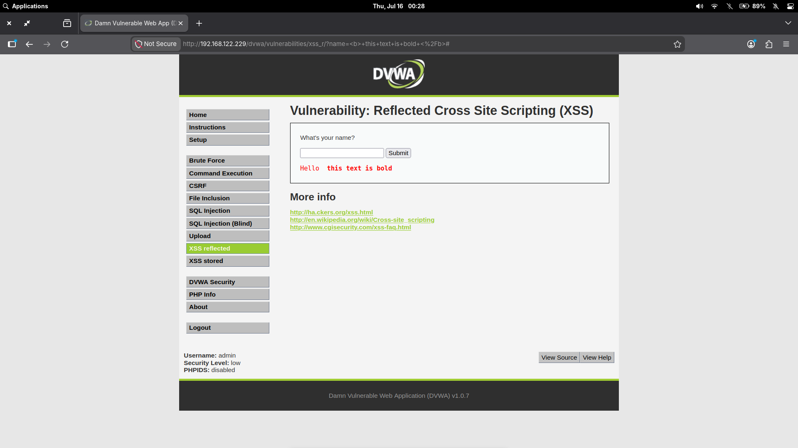
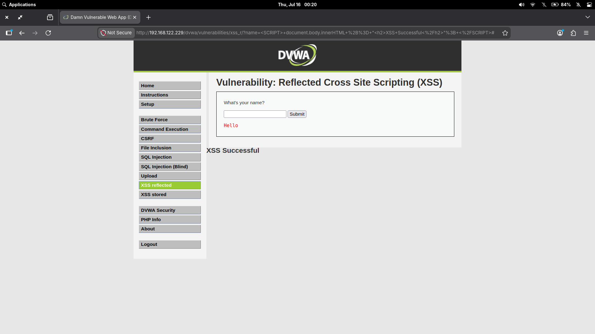

# DVWA - Reflected Cross Site Scripting (XSS)

This lab documents reflected cross site scripting in the Damn Vulnerable Web Application (DVWA) Reflected XSS module running on Metasploitable 2. The activity was performed in an isolated virtual lab environment for educational purposes.

---

## Overview

Reflected cross site scripting (XSS) occurs when an application receives user-controlled input in an HTTP request and immediately includes that input in the HTTP response without safe output encoding. The payload is not stored by the application. It is reflected back to the browser as part of the response generated for that specific request.

In a reflected XSS flow:

1. A user submits input through a URL parameter, form field, or other request value.
2. The server places that input into the response page.
3. If the input is not encoded correctly, the browser may interpret it as HTML or JavaScript instead of plain text.
4. The injected content executes or renders in the victim's browser in the context of the vulnerable site.

Reflected XSS differs from stored XSS because the payload is delivered in the request and reflected immediately. Stored XSS persists inside the application, such as in a database comment, profile field, or message, and executes later when other users view the stored content.

Reflected XSS usually occurs when applications trust request parameters too much and place them into HTML responses without context-aware escaping. Input validation can reduce unexpected input, but the main failure is unsafe output handling.

---

## Lab Objective

The objective of this DVWA exercise was to understand how reflected XSS behaves at different DVWA security levels, compare weak blacklist filtering with proper output encoding, and validate the vulnerability by reviewing the source code and observing browser-side rendering or execution.

---

## Environment

| Field | Detail |
|---|---|
| **Target Application** | Damn Vulnerable Web Application (DVWA) |
| **Target Host** | Metasploitable 2 |
| **Browser Used** | Firefox |
| **Security Levels Tested** | Low, Medium, High |
| **Lab Network** | Local isolated VM environment |
| **Vulnerability Type** | Reflected Cross Site Scripting (XSS) |

---

## Source Code Analysis

DVWA changes the server-side handling of the `name` parameter across security levels. The vulnerability is easiest to understand by comparing how each level reflects user input into the response.

### Low

```php
<?php

if(!array_key_exists ("name", $_GET) || $_GET['name'] == NULL || $_GET['name'] == ''){

    $isempty = true;

} else {

    echo '<pre>';
    echo 'Hello ' . $_GET['name'];
    echo '</pre>';

}

?>
```

At the Low security level, DVWA directly concatenates `$_GET['name']` into the response. There is no validation, no sanitization, and no output encoding. Any user-controlled HTML submitted through the `name` parameter is reflected directly back into the page.

This is vulnerable because the browser receives the input as part of the document markup. If the input contains HTML or JavaScript, the browser can interpret it as active page content instead of harmless text.

### Medium

```php
<?php

if(!array_key_exists ("name", $_GET) || $_GET['name'] == NULL || $_GET['name'] == ''){

    $isempty = true;

} else {

    echo '<pre>';
    echo 'Hello ' . str_replace('<script>', '', $_GET['name']);
    echo '</pre>';

}

?>
```

At the Medium security level, DVWA attempts to remove the exact lowercase string `<script>` with `str_replace()`. This is blacklist filtering: the application blocks one known pattern instead of safely encoding all output.

The defense is weak because `str_replace()` is case-sensitive. It removes `<script>` but does not remove variants such as `<SCRIPT>`. Blacklist filtering is unreliable because attackers can often change case, syntax, encoding, or context to avoid the blocked pattern while still producing browser-interpretable markup.

### High

```php
<?php

if(!array_key_exists ("name", $_GET) || $_GET['name'] == NULL || $_GET['name'] == ''){

    $isempty = true;

} else {

    echo '<pre>';
    echo 'Hello ' . htmlspecialchars($_GET['name']);
    echo '</pre>';

}

?>
```

At the High security level, DVWA uses `htmlspecialchars()` before reflecting the `name` parameter. This converts special HTML characters such as `<` and `>` into encoded entities.

Because the browser receives encoded text instead of raw markup, it displays the payload as text rather than interpreting it as HTML or JavaScript. This mitigates reflected XSS in this output context because user input no longer becomes executable page content.

---

## Low Security Demonstration

The Low security level was tested with a simple HTML injection payload:

```html
<b>this text is bold</b>
```

The application reflected user-controlled HTML without output encoding. Because the response contained raw `<b>` tags, the browser rendered the text in bold. This demonstrates unsafe rendering of user input and shows why direct reflection of request parameters is dangerous.


*Figure 1: Low Source Code — The Low security level directly reflects user input without sanitization or output encoding.*



*Figure 2: Low HTML Injection — The payload `<b>this text is bold</b>` is rendered by the browser, demonstrating unsafe handling of user-controlled HTML.*

---

## Medium Security Demonstration

The Medium security level was tested with an uppercase script tag payload:

```html
<SCRIPT>
document.body.innerHTML += "<h2>XSS Successful</h2>";
</SCRIPT>
```

The application removes only the exact lowercase `<script>` string using `str_replace()`. Because `str_replace()` is case-sensitive, the uppercase `<SCRIPT>` tag was not removed.

HTML tag names are case-insensitive, so Firefox interpreted `<SCRIPT>` as a valid script element. The JavaScript executed successfully and appended `XSS Successful` to the page.


*Figure 3: Medium Source Code — The Medium security level attempts to prevent XSS using a case-sensitive blacklist implemented with `str_replace()`.*



*Figure 4: Medium Successful XSS — The blacklist was bypassed using an uppercase `<SCRIPT>` tag, allowing JavaScript execution and successful reflected XSS.*

---

## Root Cause

The vulnerability exists because the application places user-controlled request data into the HTML response without consistently encoding it for the output context. In the Low level, the input is reflected directly. In the Medium level, the application tries to remove one dangerous-looking string but still returns user input as raw HTML.

Blacklist filtering is insufficient because it tries to predict every dangerous representation of a payload. Browsers accept many equivalent forms of HTML and JavaScript syntax, and a narrow blacklist usually misses variations in case, encoding, tag structure, event handlers, or browser parsing behavior.

---

## Impact

In a production application, reflected XSS can affect users who open a crafted link or submit attacker-controlled input to the vulnerable endpoint. The impact depends on the application's session handling, browser protections, and the privileges of the affected user.

Realistic consequences include:

- Session hijacking if sensitive tokens are accessible to JavaScript.
- User impersonation inside the vulnerable application.
- Credential theft through fake login prompts or client-side manipulation.
- Unauthorized actions performed in a victim's browser.
- Modification of page content to mislead users or hide malicious activity.

---

## Mitigation / Remediation

| Control | Action |
| --- | --- |
| Output encoding | Encode user-controlled data before placing it into HTML responses. |
| `htmlspecialchars()` | Use PHP's `htmlspecialchars()` for HTML body output so characters such as `<`, `>`, `"`, and `'` are rendered as text. |
| Context-aware escaping | Apply the correct escaping for the specific output context: HTML body, HTML attribute, JavaScript string, CSS, or URL. |
| Input validation | Validate expected input as a secondary control, such as allowing only names with expected characters and length. |
| Avoid blacklist filtering | Do not rely on filters that remove specific strings like `<script>`. They are easy to bypass and do not address the output-context problem. |
| Defense in depth | Use secure session cookie flags, Content Security Policy, and framework-provided templating protections where available. |

---

## Lessons Learned

- The Low level is vulnerable because it directly reflects raw user input into the response.
- The Medium level shows why blacklist filtering is unreliable: removing only lowercase `<script>` did not stop an uppercase `<SCRIPT>` tag.
- The High level mitigates this reflected XSS issue by encoding output with `htmlspecialchars()`.
- Output encoding is stronger than blacklist filtering because it changes how the browser interprets user input.
- Source code review is important during web testing because the difference between vulnerable and mitigated behavior is often visible in a single output statement.

---

## References

- [DVWA Project](https://github.com/digininja/DVWA)
- [OWASP: Cross Site Scripting](https://owasp.org/www-community/attacks/xss/)
- [OWASP Cheat Sheet: Cross Site Scripting Prevention](https://cheatsheetseries.owasp.org/cheatsheets/Cross_Site_Scripting_Prevention_Cheat_Sheet.html)
- [PHP Manual: htmlspecialchars](https://www.php.net/manual/en/function.htmlspecialchars.php)
