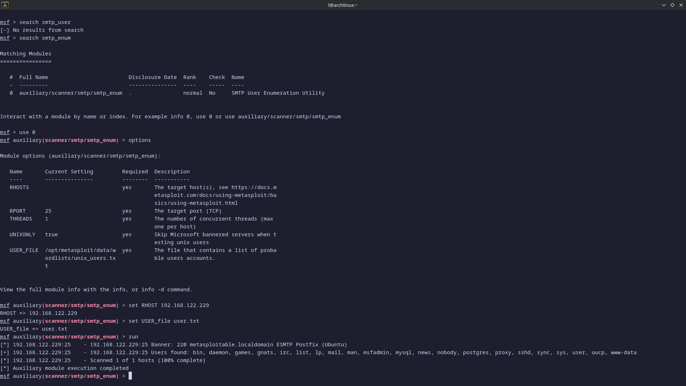

# SMTP User Enumeration — Metasploit `smtp_enum`

This lab documents SMTP user enumeration against Metasploitable 2 using Metasploit's `auxiliary/scanner/smtp/smtp_enum` auxiliary module. The activity was performed only against an intentionally vulnerable virtual machine for educational purposes.

## Objective

Enumerate valid SMTP usernames on Metasploitable 2 using `smtp_enum` with a custom wordlist, validate the Postfix banner, and confirm the discovered user list.

## Lab Environment

### Attacker Machine

- Linux penetration testing workstation (Arch Linux)
- Tools used: Metasploit Framework
- `smtp-user-enum` is not available through `pacman` on Arch, so Metasploit's built-in `smtp_enum` auxiliary module was used instead.

### Target Machine

- Target: Metasploitable 2
- Target IP: `192.168.122.229`
- Vulnerable service: SMTP (Postfix smtpd)
- SMTP port: `25/tcp`

### Network

- Isolated virtual lab network: `192.168.122.0/24`
- No internet-facing systems were tested.

## Screenshots



_Metasploit `msfconsole` session showing `auxiliary/scanner/smtp/smtp_enum` configured with `RHOSTS` and `USER_FILE`, the Postfix banner `220 metasploitable.localdomain ESMTP Postfix (Ubuntu)`, and the enumerated user list._

## Enumeration

### Why SMTP Enumeration

SMTP on port 25 is often misconfigured to accept the `VRFY` command, which lets an attacker enumerate valid usernames on the server before attacking other services on the same host.

### Why msfconsole Instead of smtp-user-enum

`smtp-user-enum` is not packaged for Arch Linux through `pacman`. Metasploit ships a drop-in replacement — the `smtp_enum` auxiliary module — which provides the same `VRFY`-based enumeration workflow.

### User Wordlist

The wordlist at `/home/l/user.txt` was used as `USER_FILE`. It contains common Metasploitable usernames.

### smtp_enum Module

The module was configured and run inside `msfconsole`:

```text
search smtp_enum
use 0
set RHOSTS 192.168.122.229
set USER_FILE /home/l/user.txt
run
```

Result:

```text
[*] 192.168.122.229:25 Banner: 220 metasploitable.localdomain ESMTP Postfix (Ubuntu)
[+] 192.168.122.229:25 Users found: bin, daemon, games, gnats, irc, list, lp, mail, man, msfadmin, mysql, news, nobody, postgres, proxy, sshd, sync, sys, user, uucp, www-data
[*] 192.168.122.229:25 - Scanned 1 of 1 hosts (100% complete)
[*] Auxiliary module execution completed
```

### Valid Users Discovered

| Username |
| -------- |
| bin      |
| daemon   |
| games    |
| gnats    |
| irc      |
| list     |
| lp       |
| mail     |
| man      |
| msfadmin |
| mysql    |
| news     |
| nobody   |
| postgres |
| proxy    |
| sshd     |
| sync     |
| sys      |
| user     |
| uucp     |
| www-data |

## Vulnerability Identification

The target runs Postfix smtpd on port `25/tcp`. The banner reveals `220 metasploitable.localdomain ESMTP Postfix (Ubuntu)`. The `VRFY` command is enabled, allowing enumeration of valid system usernames — a classic SMTP misconfiguration that exposes the account inventory for later brute-force phases.

## Lessons Learned

- `smtp-user-enum` may not be available on all distributions. Metasploit's `smtp_enum` auxiliary module is a drop-in replacement on Arch Linux.
- SMTP `VRFY` enumeration reveals valid system usernames that can be reused against SSH, FTP, Telnet, and other services on the same host.
- The `/home/l/user.txt` wordlist matched a large portion of valid accounts — including `msfadmin`, `postgres`, `mysql`, and system accounts like `www-data` and `proxy`.
- Port 25 enumeration should be part of every Metasploitable 2 scan; it adds to the credential inventory for later exploitation phases.
- Metasploit accepts option names flexibly, but `show options` remains the source of truth for the exact name and type.

## Remediation

| Control              | Action                                                               |
| -------------------- | -------------------------------------------------------------------- |
| Disable VRFY         | Configure the SMTP server to disable or restrict the `VRFY` command. |
| SMTP hardening       | Set `disable_vrfy_command = yes` in Postfix configuration.           |
| Strong credentials   | Ensure all enumerated accounts have strong, unique passwords.        |
| Monitoring           | Alert on `VRFY` command usage from unexpected sources.               |
| Network segmentation | Restrict SMTP access to authorized management networks only.         |

## References

- [Metasploit Documentation: smtp_enum](https://docs.metasploit.com/docs/using-metasploit/basics/using-metasploit.html)
- [Metasploitable 2 Documentation](https://docs.rapid7.com/metasploit/metasploitable-2/)
- [Postfix: disable_vrfy_command](https://www.postfix.org/postconf.5.html#disable_vrfy_command)
