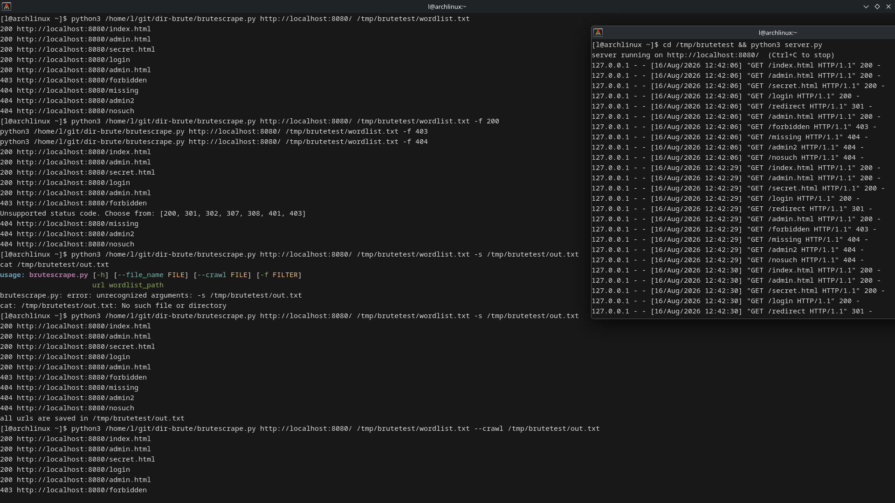
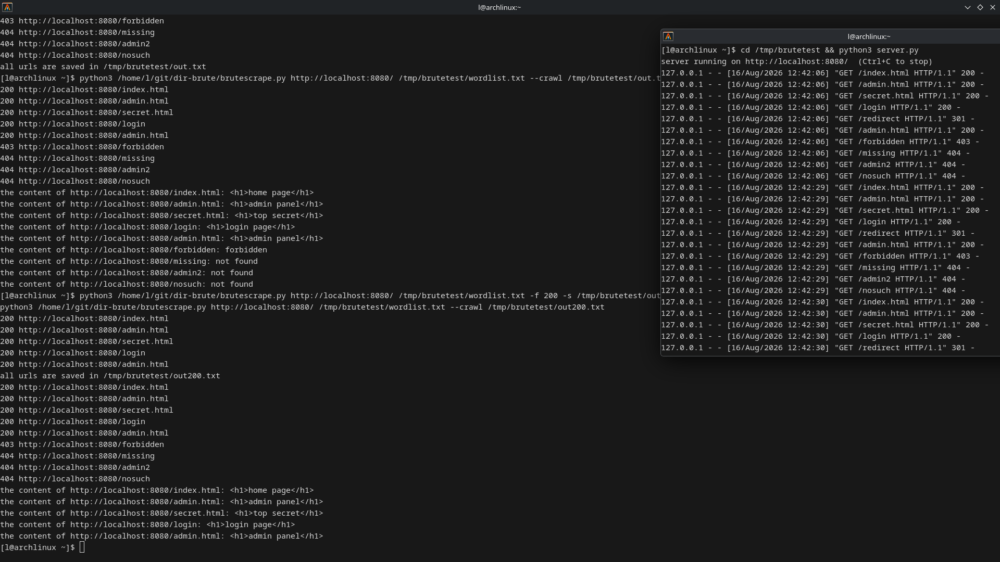

# dir-brute — Directory Enumeration Against a Local Test Server

This lab documents using my own [dir-brute](https://github.com/Utkarsh464/dir-brute) tool to brute-force a local test server, watch the server react in real time, and fix bugs in the tool found along the way. The activity was performed on localhost in an isolated test environment for educational purposes.

---

## Objective

Enumerate hidden paths on a local web server with my own Python brute-forcer, filter results by status code, save live URLs, crawl their contents, and harden the tool itself based on what broke during testing.

---

## Lab Information

| Field                  | Detail                                                                                              |
| ---------------------- | --------------------------------------------------------------------------------------------------- |
| **Target**             | Local test server — `http://localhost:8080`                                                         |
| **Attacker**           | Same machine (Linux workstation)                                                                    |
| **Difficulty**         | Beginner                                                                                            |
| **Tools Used**         | [dir-brute](https://github.com/Utkarsh464/dir-brute) (`brutescrape.py`), Python `http.server`, curl |
| **Vulnerability Type** | Exposed paths, no authentication on hidden pages                                                    |
| **Date**               | 2026-08-16                                                                                          |

---

## Lab Setup

A custom Python HTTP server (`server.py`, ~40 lines, stdlib only) was started on port `8080`. It was deliberately written to return a spread of status codes so the brute-forcer could be tested against every case:

| Path                                                   | Response               |
| ------------------------------------------------------ | ---------------------- |
| `/index.html`, `/admin.html`, `/secret.html`, `/login` | `200` — page with body |
| `/redirect`                                            | `301` → `/admin.html`  |
| `/forbidden`                                           | `403` — forbidden      |
| anything else                                          | `404` — not found      |

The wordlist contained 9 paths: `index.html`, `admin.html`, `secret.html`, `login`, `redirect`, `forbidden`, `missing`, `admin2`, `nosuch`.

Server startup:

```text
server running on http://localhost:8080/  (Ctrl+C to stop)
```

---

## Execution

### 1. Plain brute-force

Running the tool with no flags enumerated the wordlist and printed every response — the five `200`s, the `403`, and the three `404`s:

```bash
python3 /home/l/git/dir-brute/brutescrape.py http://localhost:8080/ /tmp/brutetest/wordlist.txt
```

```text
200 http://localhost:8080/index.html
200 http://localhost:8080/admin.html
200 http://localhost:8080/secret.html
200 http://localhost:8080/login
200 http://localhost:8080/admin.html
403 http://localhost:8080/forbidden
404 http://localhost:8080/missing
404 http://localhost:8080/admin2
404 http://localhost:8080/nosuch
```

Note that `/redirect` shows as `200 http://localhost:8080/admin.html` — the HTTP client follows the `301` automatically, so a redirect ends up reported as the final target's status.

### 2. Filtering by status code

The `-f` flag shows only one status code. This is useful for pulling out just the live pages, or just the dead ends:

```bash
python3 /home/l/git/dir-brute/brutescrape.py http://localhost:8080/ /tmp/brutetest/wordlist.txt -f 200
python3 /home/l/git/dir-brute/brutescrape.py http://localhost:8080/ /tmp/brutetest/wordlist.txt -f 403
python3 /home/l/git/dir-brute/brutescrape.py http://localhost:8080/ /tmp/brutetest/wordlist.txt -f 404
```

```text
# -f 200
200 http://localhost:8080/index.html
200 http://localhost:8080/admin.html
200 http://localhost:8080/secret.html
200 http://localhost:8080/login
200 http://localhost:8080/admin.html

# -f 403
403 http://localhost:8080/forbidden

# -f 404
404 http://localhost:8080/missing
404 http://localhost:8080/admin2
404 http://localhost:8080/nosuch
```

### 3. Saving and crawling

The `-s` flag writes every matching URL to a file, and `--crawl` reads a saved file back and dumps each page's contents:

```bash
python3 /home/l/git/dir-brute/brutescrape.py http://localhost:8080/ /tmp/brutetest/wordlist.txt -s /tmp/brutetest/out.txt
python3 /home/l/git/dir-brute/brutescrape.py http://localhost:8080/ /tmp/brutetest/wordlist.txt --crawl /tmp/brutetest/out.txt
```

```text
the content of http://localhost:8080/index.html: <h1>home page</h1>
the content of http://localhost:8080/admin.html: <h1>admin panel</h1>
the content of http://localhost:8080/secret.html: <h1>top secret</h1>
the content of http://localhost:8080/login: <h1>login page</h1>
the content of http://localhost:8080/admin.html: <h1>admin panel</h1>
the content of http://localhost:8080/forbidden: forbidden
the content of http://localhost:8080/missing: not found
the content of http://localhost:8080/admin2: not found
the content of http://localhost:8080/nosuch: not found
```

Combining `-f 200` with `-s` produces a file containing only the live pages, which crawls cleanly:

```bash
python3 /home/l/git/dir-brute/brutescrape.py http://localhost:8080/ /tmp/brutetest/wordlist.txt -f 200 -s /tmp/brutetest/out200.txt
python3 /home/l/git/dir-brute/brutescrape.py http://localhost:8080/ /tmp/brutetest/wordlist.txt --crawl /tmp/brutetest/out200.txt
```



### 4. Watching the server react

The server was updated to log every request. While the brute-forcer ran, the server terminal filled up with the exact paths and status codes being requested in real time — confirmation that each wordlist entry produced a live HTTP request:

```text
127.0.0.1 - - [16/Aug/2026 12:42:06] "GET /index.html HTTP/1.1" 200 -
127.0.0.1 - - [16/Aug/2026 12:42:06] "GET /admin.html HTTP/1.1" 200 -
127.0.0.1 - - [16/Aug/2026 12:42:06] "GET /secret.html HTTP/1.1" 200 -
127.0.0.1 - - [16/Aug/2026 12:42:06] "GET /login HTTP/1.1" 200 -
127.0.0.1 - - [16/Aug/2026 12:42:06] "GET /redirect HTTP/1.1" 301 -
127.0.0.1 - - [16/Aug/2026 12:42:06] "GET /admin.html HTTP/1.1" 200 -
127.0.0.1 - - [16/Aug/2026 12:42:06] "GET /forbidden HTTP/1.1" 403 -
127.0.0.1 - - [16/Aug/2026 12:42:06] "GET /missing HTTP/1.1" 404 -
127.0.0.1 - - [16/Aug/2026 12:42:06] "GET /admin2 HTTP/1.1" 404 -
127.0.0.1 - - [16/Aug/2026 12:42:06] "GET /nosuch HTTP/1.1" 404 -
```



---

## Bugs Found and Fixed in the Tool

Testing the tool against the server surfaced real bugs, which were fixed on the spot:

| Bug                                                  | Symptom                                       | Fix                                                                  |
| ---------------------------------------------------- | --------------------------------------------- | -------------------------------------------------------------------- |
| Scan loop gated behind `--file_name`                 | Running without `-s` printed nothing          | Moved the loop out of the `if file_name is not None:` block          |
| Save block reopened the file in `"w"` mode per match | Only the last URL survived in the file        | Open the file once before the loop, write with `+ "\n"`              |
| `--crawl` argument not wired up                      | Crawling never ran, or crawled the wrong file | Pass `args.crawl` to the crawler, drop the `--file_name` requirement |
| No `-s` shorthand                                    | `unrecognized arguments: -s`                  | Registered `-s` as an alias for `--file_name`                        |
| `correct_code(None)` fired on every run without `-f` | Spurious "Unsupported status code" error      | Only validate the filter when `-f` is passed                         |
| Crawler didn't strip lines                           | `requests.get()` choked on trailing newline   | `url = url.strip()` before requesting                                |

---

## Findings

| Finding                                | Detail                                                                                                         |
| -------------------------------------- | -------------------------------------------------------------------------------------------------------------- |
| **Hidden pages exposed**               | `/admin.html` and `/secret.html` are reachable with no authentication — anyone can read them                   |
| **Wordlist noise**                     | Most paths in a real wordlist 404; status filtering (`-f 200`) is what makes the signal visible                |
| **Redirects look like 200s**           | Following redirects means a `301` target reports the final page's status — important when interpreting results |
| **Server logging is the ground truth** | Watching the server log confirmed the tool was generating real requests, one per wordlist entry                |

---

## Lessons Learned

1. **Test against a server you control.** A custom server with predictable status codes makes it obvious when a tool is wrong — the bugs above only surfaced because every request was expected and observable.
2. **Watch both terminals.** The server log and the tool output together tell the full story: request sent, response received, status interpreted.
3. **Status filtering turns noise into signal.** With a real-world wordlist (thousands of entries), almost everything is a `404`; `-f 200` (or `-f 403`) is what makes interesting paths pop.
4. **Redirect-following changes what you see.** If a path returns `301`/`302`, the tool reports the final destination's status. For redirect-only enumeration you would disable redirect following.
5. **A tool is never done after it "works" once.** The very first "successful" run had the loop-gating bug; it only became visible when running without `-s`.

---

## References

- [dir-brute — the tool used in this lab](https://github.com/Utkarsh464/dir-brute)
- [Python `http.server` documentation](https://docs.python.org/3/library/http.server.html)
- [Python `requests` documentation](https://requests.readthedocs.io/)
