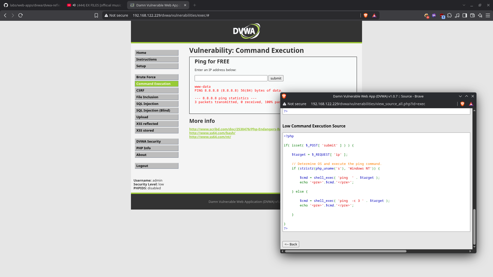
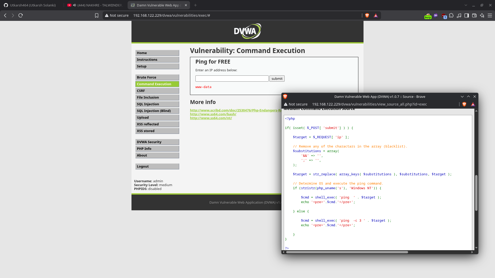

# DVWA - OS Command Execution (Command Injection)

This lab documents OS command injection in the Damn Vulnerable Web Application (DVWA) Command Execution module running on Metasploitable 2. It compares the Low and Medium security levels: Low performs no filtering, while Medium adds an incomplete blacklist that is easy to bypass. The activity was performed in an isolated virtual lab environment for educational purposes.

---

## Overview

OS command injection occurs when an application receives user-controlled input and concatenates it into a shell command without sanitizing or escaping it. Instead of being treated as data, the input becomes part of the operating system command that the server executes.

In the DVWA Command Execution module, the application asks for an IP address and runs a `ping` command against it. Because the submitted value is placed directly into a shell command, a crafted value can append additional commands that run alongside `ping`.

The severity depends on which user the web server runs as. In this lab the injected commands execute as `www-data`, the web server user, which is enough to read files, run tools, and look for privilege escalation paths.

---

## Lab Objective

The objective was to understand how DVWA's command execution handling changes across security levels, compare a completely unprotected low level with a blacklist-protected medium level, and validate command execution on each by running a simple command and confirming the result.

---

## Environment

| Field                      | Detail                                 |
| -------------------------- | -------------------------------------- |
| **Target Application**     | Damn Vulnerable Web Application (DVWA) |
| **Target Host**            | Metasploitable 2                       |
| **Browser Used**           | Firefox                                |
| **Security Levels Tested** | Low, Medium                            |
| **Lab Network**            | Local isolated VM environment          |
| **Vulnerability Type**     | OS Command Injection                   |

---

## Source Code Analysis

DVWA reads the submitted value from `$_REQUEST['ip']` and passes it straight into `shell_exec()`. The two security levels differ only in how they handle input before it reaches the shell.

### Low

```php
<?php

if( isset( $_POST[ 'submit' ] ) ) {

    $target = $_REQUEST[ 'ip' ];

    // Determine OS and execute the ping command.
    if (stristr(php_uname('s'), 'Windows NT')) {

        $cmd = shell_exec( 'ping  ' . $target );
        echo '<pre>'.$cmd.'</pre>';

    } else {

        $cmd = shell_exec( 'ping  -c 3 ' . $target );
        echo '<pre>'.$cmd.'</pre>';

    }

}
?>
```

At the Low security level there is no validation, no sanitization, and no blacklist. The submitted value is concatenated directly into `shell_exec('ping  -c 3 ' . $target)`. Because `shell_exec` invokes a shell, every character in `$target` is honored as shell syntax, so any command separator or chaining operator works.

### Medium

```php
<?php

if( isset( $_POST[ 'submit'] ) ) {

    $target = $_REQUEST[ 'ip' ];

    // Remove any of the charactars in the array (blacklist).
    $substitutions = array(
        '&&' => '',
        ';' => '',
    );

    $target = str_replace( array_keys( $substitutions ), $substitutions, $target );

    // Determine OS and execute the ping command.
    if (stristr(php_uname('s'), 'Windows NT')) {

        $cmd = shell_exec( 'ping  ' . $target );
        echo '<pre>'.$cmd.'</pre>';

    } else {

        $cmd = shell_exec( 'ping  -c 3 ' . $target );
        echo '<pre>'.$cmd.'</pre>';

    }
}

?>
```

The Medium level attempts to defend the module with a blacklist:

```php
$substitutions = array(
    '&&' => '',
    ';' => '',
);
```

`str_replace()` removes every occurrence of `&&` and `;` before the value is used. This blocks the two most obvious command separators:

- `127.0.0.1 && whoami` becomes `127.0.0.1  whoami` (the `&&` is stripped, so the payload breaks).
- `127.0.0.1 ; whoami` becomes `127.0.0.1  whoami` (the `;` is stripped, so the payload breaks).

#### Why the blacklist is insufficient

Blacklist filtering only fails safely if it blocks every representation an attacker can use. This blacklist removes exactly two separators (`&&` and `;`) but leaves the pipe operator `|` untouched. Because only these two strings are removed, a payload that does not contain them passes through unchanged.

The pipe operator is a valid shell metacharacter: `command1 | command2` sends the output of `command1` to the input of `command2`. Since `|` is not in the substitution array, it survives the filter and reaches the shell.

---

## Low Security Demonstration

Because the Low level applies no filtering, a standard separator such as `;` works directly. The IP field was given the following input:

```
<target> ; whoami
```

The command the server executes becomes:

```
ping -c 3 <target> ; whoami
```

The `;` chains `whoami` after the `ping` command, regardless of whether the ping succeeds. The response displayed the `whoami` output:

```
www-data
```

This confirms arbitrary command execution as the `www-data` user at the Low security level, with no input protection at all.



_Figure 1: Low Command Execution — The DVWA Command Execution module at Low shows the unfiltered source (no blacklist) and the result of the injected command, which printed `www-data`._

---

## Medium Security Demonstration

At the Medium level, `;` and `&&` are stripped by the blacklist, so a semicolon-based payload is broken. The IP field was therefore given the following input, using the pipe operator which is not filtered:

```
127.0.0.1 | whoami
```

`str_replace()` removes none of it — there is no `&&` or `;` in the payload — so the command the server executes becomes:

```
ping -c 3 127.0.0.1 | whoami
```

`ping` runs against the loopback address, and its output is piped to `whoami`. Because the payload did not use a blacklisted separator, the pipe was not stripped and the command injection succeeded. The response displayed:

```
www-data
```



_Figure 2: Medium Command Execution — The DVWA Command Execution module shows the blacklist source (only `&&` and `;` removed) and the result of `127.0.0.1 | whoami`, which printed `www-data`._

---

## Root Cause

The vulnerability exists because the application concatenates user-controlled input directly into a shell command built with `shell_exec()`. The input is never treated as data — every character becomes part of the command line, so shell metacharacters are honored.

At the Low level there is no defense at all, so any separator works. At the Medium level the defense is an incomplete blacklist that removes only `&&` and `;`. Blacklist filtering cannot fully mitigate command injection because there are many equivalent ways to chain commands in a shell. Here, the pipe operator `|` was not filtered and provided the bypass.

---

## Impact

Successful OS command injection grants the attacker the ability to run arbitrary commands on the host, with the privileges of the web server process (`www-data`).

Realistic consequences include:

- Reading sensitive files such as configuration files, databases, or source code.
- Running arbitrary tools and binaries installed on the host.
- Establishing a reverse or bind shell for interactive access.
- Using the compromised host as a foothold to pivot to other machines.
- Combining with a local privilege escalation to reach root.

---

## Mitigation / Remediation

| Control                            | Action                                                                                                                                                              |
| ---------------------------------- | ------------------------------------------------------------------------------------------------------------------------------------------------------------------- |
| Avoid `shell_exec` with user input | Never pass user-controlled values into shell commands. Use safer alternatives such as PHP functions, libraries, or parameterized APIs that do not invoke a shell.   |
| Escape shell arguments             | If a shell call is unavoidable, escape the value with `escapeshellarg()` so it is treated as a single argument rather than shell syntax.                            |
| Allow-list validation              | Validate the input against a strict pattern (for example, a regex that only allows IPv4 addresses) and reject anything else. This is far stronger than a blacklist. |
| Avoid blacklist filtering          | Do not rely on filters that remove a few known strings. There are many shell metacharacters and bypass techniques, so a narrow blacklist is easy to evade.          |
| Least privilege                    | Run the web server with minimal privileges and sandbox it so a compromise does not expose the whole host.                                                           |
| Defense in depth                   | Combine validation, escaping, least privilege, and monitoring.                                                                                                      |

---

## Lessons Learned

- Concatenating user input into `shell_exec()` is command injection; `shell_exec` invokes a shell, so shell metacharacters are honored.
- The Low level performs no filtering, so `;`, `&&`, `|`, and other separators all work.
- The Medium level removes only `&&` and `;`. A payload using `|` bypasses the filter because the pipe is not blacklisted.
- Blacklist filtering is unreliable for command injection because attackers can choose from many equivalent separators and techniques.
- Allow-listing input and escaping shell arguments are far stronger protections than trying to predict and remove dangerous strings.
- Running `whoami` is a fast, low-noise way to confirm command execution and see which user the injected commands run as.

---

## References

- [DVWA Project](https://github.com/digininja/DVWA)
- [OWASP: Command Injection](https://owasp.org/www-community/attacks/Command_Injection)
- [OWASP Cheat Sheet: OS Command Injection Defense](https://cheatsheetseries.owasp.org/cheatsheets/OS_Command_Injection_Defense_Cheat_Sheet.html)
- [PHP Manual: shell_exec](https://www.php.net/manual/en/function.shell-exec.php)
